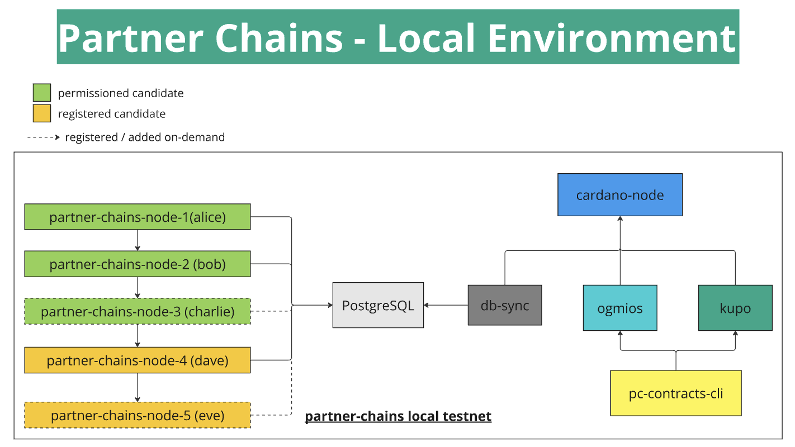

# Partner Chains Local Environment

This stack is designed to run a 5 x Partner Chains node local environment for a partner chain. It is based on the custom IO Substrate image.



The local environment includes:

- 5 x Partner Chains Nodes (3 x permissioned, 2 x registered)
- 1 x Cardano Node running private testnet with pre-configured genesis files (2 minutes epochs)
- 1 x PostgreSQL database
- 1 x Db-sync
- 1 x Ogmios
- 1 x Kupo
- 1 x Ubuntu / NodeJS image for running pc-contracts-cli
- 1 x Partner Chains Setup container based on Partner Chains Node Image to setup the smart-contracts

The stack `setup.sh` script will create a docker-compose.yml stack configuration files, and populate an .env file with environment values. The stack can be deployed with `docker-compose up -d`.

## Local env - step by step

- When first run, all images will be pulled from public repositories. This stage may take some time. The stack will then be built and run.
- When the stack is running, the Cardano node begins block production. This is a private testnet and will not connect to the public Cardano network, but rather from a pre-configured genesis file.
- Once the Cardano chain is synced, Ogmios, Kupo and DB-Sync will in turn connect to the Cardano node node.socket and begin syncing the chain.
- The partner-chains-setup will insert D parameter values and register Partner Chains Node keys with the Cardano chain.
- Once Postgres is populated with the required data, the Partner Chains nodes will begin syncing the chain and will begin block production after 2 main chain epochs.

## Initialising the environment configuration

Run `setup.sh` script to enter the setup wizard for initialising the environment .env values and docker-compose.yml. The `setup.sh` script also support a `--non-interactive` flag to accept default configuration settings, or configuration elements can be specified directly with args (see `--help` for details)

```
chmod +x setup.sh
bash setup.sh`
```

## Starting the environment

Once initialized, deploy the local environment from .env values with the following:

```
docker compose up -d
```

We recommend using a visual Docker UI tool such as [lazydocker](https://github.com/jesseduffield/lazydocker) or [Docker Desktop](https://www.docker.com/products/docker-desktop/) for following the live logs and performance of all containers in the environment. Each component has been scripted to provide verbose logging of all configuration actions it is performing to demonstrate the end-to-end setup of a Cardano Partner Chain.

## Stopping the environment

When stopping the stack, it is mandatory to also wipe all volumes. The environment does not yet support persistent state. To tear down the environment and remove all volumes, use the following:

```
docker compose down --volumes
```

## Custom Images and Artifacts

To use custom node image one simply has to update `PARTNER_CHAINS_NODE_IMAGE` (docker image) and `PARTNER_CHAINS_NODE_URL` (node artifact, used to build chain-spec and execute chain setup smart-contracts)

These can be found at the very top of the `setup.sh` script.

Make sure that `PC_CONTRACTS_CLI_ZIP_URL` version is compatible with your custom node.

Alternatively artifact URLs can be overriden from local files with the `--overrides` argument. See main `setup.sh` interactive dialogue for more details.

```
cd dev/local-environment
cp /path/to/artifact ./configurations/pc-contracts-cli/overrides/partner-chains-cli
cp /path/to/artifact ./configurations/pc-contracts-cli/overrides/partner-chains-node
bash setup.sh --non-interactive --overrides --node-image ${{ inputs.image }}
```

## Custom Deployment Options

The `setup.sh` script supports argument `--deployment-option X` with the below possible options:

1. Include only Cardano testnet
2. Include Cardano testnet with Kupo and Ogmios
3. Include Cardano testnet, Kupo, Ogmios, DB-Sync and Postgres
4. Deploy a single Partner Chains node with network_mode: "host" for external connections

Option 3 is suitable for providing a local Postgres with our minimal Cardano chain for local testing. Option 4 is suitable for deploying individual Partner Chain Nodes accross distrubted systems.

## Other Features

We are continuing to develop this utility for a range of appications, and regularly add additional features. The `setup.sh --help` output will always show the latest details for available features:

```
$ bash setup.sh --help
Usage: setup.sh [OPTION]...
Initialize and configure the Docker environment.
  -n, --non-interactive     Run with no interactive prompts and accept sensible default configuration settings.
  -d, --deployment-option   Specify one of the custom deployment options (1, 2, 3, or 4).
  -p, --postgres-password   Set a specific password for PostgreSQL (overrides automatic generation).
  -o, --overrides           Enable custom artifact overrides from artifacts in ./configurations/pc-contracts-cli/ (PC and PCSC).
  -i, --node-image          Specify a custom Partner Chains Node image.
  -t, --tests               Include tests container.
  -h, --help                Display this help dialogue and exit.
```
