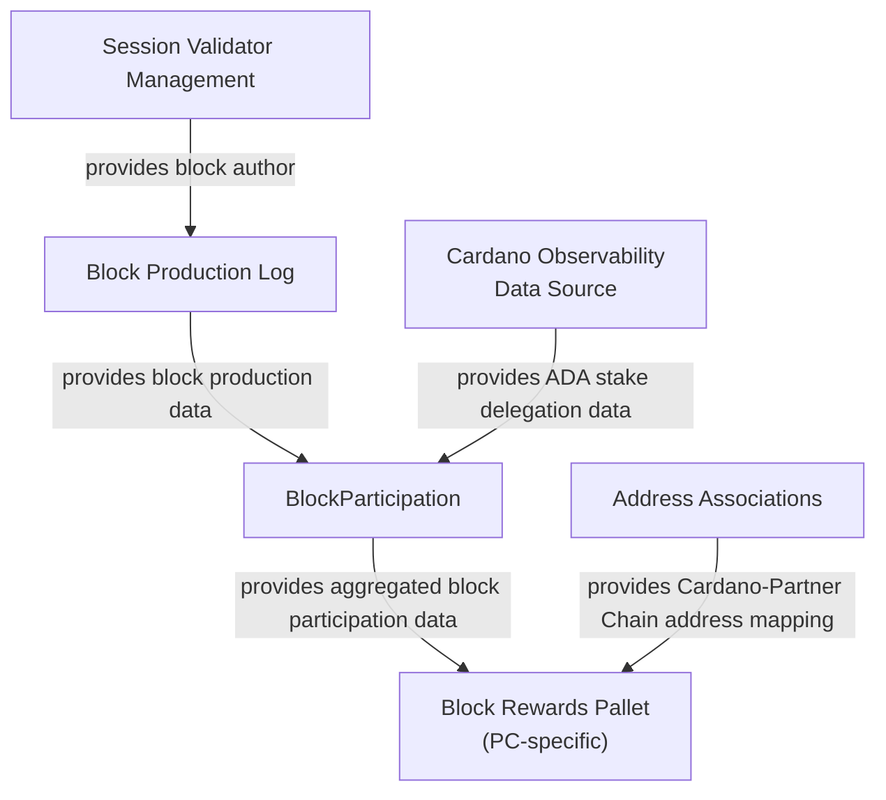

# Block Participation Rewards Implementation Guide

## Introduction

This document explains how multiple components of the Partner Chains SDK can be used together
to implement a mechanism for rewarding Partner Chain block producers (Cardano SPOs) and their
delegators.
 
## Overview

This guide assumes the Partner Chain uses `pallet-session-validator-management` to track its
committee and uses the Ariadne selection algorithm based on D-Param, Cardano SPO registrations,
and a permissioned candidate set, as provided by the `authority-selection-inherents` crate.

Throughout this guide, the following components will be combined to handle block rewards:
1. Block production log (implemented through crates `sp-block-production-log` and `pallet-block-production-log`)
   to track information on the author of each block produced in the chain
2. Address associations (implemented by the `pallet-address-associations` crate) to store and resolve
   mappings between Cardano and Partner Chain identities of SPOs and their delegators.
3. Block participation data (implemented through crates `sp-block-participation` and `pallet-block-participation`)
   to periodically release aggregated data on block producers, their Cardano delegators and their
   respective Cardano ADA stake. This component utilizes a Cardano observability data source
   to fetch stake delegation data.
4. A custom-written payouts pallet (implemented by each Partner Chain's developers) that will
   calculate, track and distribute rewards upon consuming block participation data.

The flow of data between these components can be seen in the following diagram:

   
## Adding the Block Production Log
