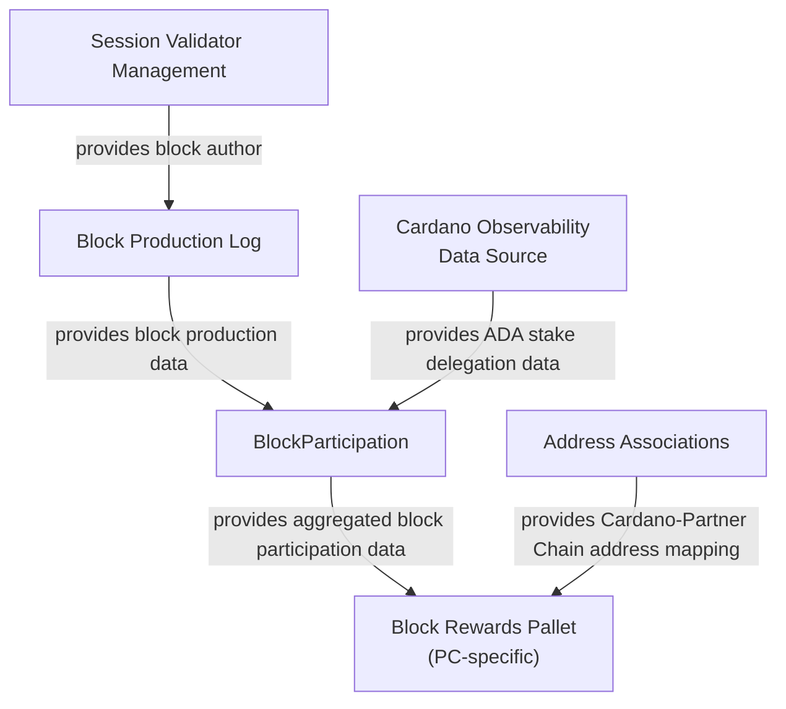

# Block Participation Rewards Implementation Guide

## Introduction

This document explains how multiple components of the Partner Chains SDK can be used together
to implement a mechanism for rewarding Partner Chain block producers (Cardano SPOs) and their
delegators.
 
## Overview

This guide assumes the Partner Chain uses `pallet-session-validator-management` to track its
committee and uses the Ariadne selection algorithm based on D-Param, Cardano SPO registrations,
and a permissioned candidate set, as provided by the `authority-selection-inherents` crate.

The following components will be combined to handle block rewards:
1. Block production log (implemented through crates `sp-block-production-log` and `pallet-block-production-log`)
   to track information on the author of each block produced in the chain
2. Address associations (implemented by the `pallet-address-associations` crate) to store and resolve
   mappings between Cardano and Partner Chain identities of SPOs and their delegators.
3. Block participation data (implemented through crates `sp-block-participation` and `pallet-block-participation`)
   to periodically release aggregated data on block producers, their Cardano delegators and their
   respective Cardano ADA stake. This component utilizes a Cardano observability data source
   to fetch stake delegation data.
4. A custom-written payouts pallet (implemented by each Partner Chain's developers themselves) that will
   calculate, track and distribute rewards upon consuming block participation data.

The flow of data between these components can be seen in the following diagram:


## Implementation Guide

The following sections describe briefly steps to take while implementing a block rewards payment solution
in a Partner Chain. Please consult documentation of individual Rust crates for details.
A reference implementation of a Partner Chain using the features listed above in a way congruent with this
guide can be found in the `demo/` folder of this project.

### Defining the types

The Partner Chains SDK components used in this guide require every individual Partner Chain to define some
common Rust types for them to operate on. These types are chain-specific, but must conform to the interfaces
expected by the PC SDK components

#### Partner Chain Address

A `PartnerChainAddress` representing a payable account on the Partner Chain. This type will be used by the Address
Associations to provide mappings from Cardano to local addresses. For chains using stock Balances Pallet,
`AccountId32` can be used, otherwise this type should be whatever type is used by particular Partner Chain's ledger.

#### Block Author

A `BlockAuthor` type representing the identity of a block producer. This type will be used by the Block
Production Log pallet when storing information on block authorship, and be consumed by the block
participation feature when providing aggregated block participation data.

This type should be obtainable from the type `CommitteeMember` configured for the Session Validator Management pallet
using the `From` trait.

As this guide assumes block producers are selected using Ariadne algorithm and Cardano data, a block producer type
can look like the following:
```rust
pub enum BlockAuthor {
	Incentivized(CrossChainPublic, StakePoolPublicKey),
	ProBono(CrossChainPublic),
}
```
where the block producers are either Cardano SPOs (`Incentivized`) or permissioned candidates (`ProBono`).

This type should implement the `sp_block_participation::AsCardanoSPO` trait to allow the block participation mechanism
to distinguish between SPO and non-SPO instances of this type.

#### Delegator

A `Delegator` type representing the identity of delegators of the block producers identified by `BlockAuthor`.
This type will be used by the block participation feature to identify secondary block participants in the
released aggregate data.

This type is assumed to represent a Cardano ADA delegator (with permissioned candidates
having no delegators). As such, this type must implement the `sp_block_participation::CardanoDelegator` trait
to be constructable from `sidechain_domain::DelegatorKey`. To avoid any boilerplate, `sidechain_domain::DelegatorKey`
itself can be used.

### Adding the Partner Chains SDK components

#### Block Production Log

The pallet should be added to the runtime and configured to use `BlockAuthor` type as its `BlockProducerId`, and
an inherent data provider of type `BlockAuthorInherentProvider<BlockAuthor>` should be added to both the proposal
and verification IDP stack of the node.

The runtime should implement the `BlockProductionLogApi` runtime API to expose the current block producer to the
inherent data provider via the `get_author` method. This method's implementation depends on the consensus used by
the Partner Chain. If the consensus mechanism used is Aura, the function `get_current_authority_round_robin`
exposed by the Session Validator Management pallet should be used, which applies the same round-robin algorithm.

#### Address Associations

The Address Associations pallet is a stand-alone pallet with minimal requirements.
It should be added to the runtime and configured to use the `PartnerChainAddress` type.

The `OnNewAssociation` handler should be set to the no-op value of `()` for now - it will be set later.

Additionally, to allow users to submit associations transaction to the pallet, a `sign-address-association` command
is provided by the `partner-chains-node-commands` crate that should be wired into the node command definitions.

#### Block Participation Data

##### Runtime

The pallet should be added to the runtime and configured to use `BlockAuthor` and `Delegator` types.
It should also be wired to use the block production log as the source of block production data.

The `should_release_data` function in the pallet's configuration should be implemented in a way that matches the
intended reward payout frequency and delay.

The `TARGET_INHERENT_ID` value should be set to the inherent ID that will be used by the user-provided payouts pallet.

Finally, the runtime should implement the `BlockParticipationApi` runtime API exposing functions and values from the
pallet and its config.

##### Node

An inherent data provider of type `BlockParticipationInherentDataProvider<BlockAuthor, Delegator>` should be added
to both proposal and validation IDP stack in the node. This requires also creating a data source conforming to the
`BlockParticipationDataSource` trait - implementations for which are provided by the types
`partner_chains_db_sync_data_sources::StakeDistributionDataSourceImpl` (production Db-Sync implementation)
and `partner_chains_mock_data_sources::StakeDistributionDataSourceMock` (mock implementation for testing purposes).

### Writing the Rewards Payouts Pallet

Each Partner Chain should implement its own payouts pallet according to its use cases and using its own ledger logic.
The following is a description of just one way to do it.

#### Defining the pallet

A pallet should be created with an inherent `pay_rewards` using inherent ID configured in `TARGET_INHERENT_ID`
of the Block Participation pallet.
This inherent will consume inherent data produced by the block participation feature to calculate block participation
rewards and perform reward payouts.

The `pay_rewards` extrinsic should be able to identify payable accounts belonging to `BlockAuthor`s and `Delegator`s.
For ADA delegators and Cardano SPOs, these accounts should be queried from the Address Associations pallet
using the `get_partner_chain_address_for` function exposed by it. Permissioned candidates on the other hand are not
required to maintain any identity on Cardano, hence they should either be skipped in the payouts, or an alternative
source of Partner Chain identity must be used.

The payouts themselves are inherently tied to the way each individual Partner Chain's ledger is structured. This
logic is left completely to the Parnter Chain builder to design.

#### Handling late address associations

Due to the way the block production log and block participation feature are implemented, participation data on each
block is only once included in the inherent data emitted by the block participation feature (as the production log
is then cleared of already processed values). This means that all data included in the inherent data must be processed
on that occasion, or intentionally preserved for the future by the payouts pallet itself.

A need for this can arise when a particular ADA delegator whose participation is being processed does not have
their Partner Chain address stored in the Address Associations Pallet yet. In that situation, the pallet must store
outstanding rewards for the future so they can be paid out when the user finally associates their address.
To facilitate this, the Address Associations pallet's configuration includes a `OnNewAssociation` hook. The payouts
pallet should implement logic for that hook, which would perform a payout in case a delegator with outstanding rewards
associates their address.
