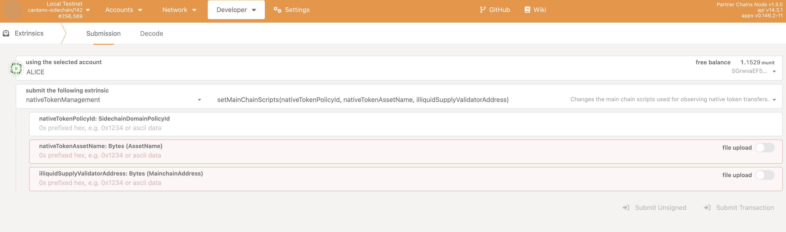

# Native token reserve management

## Overview

This guide covers the following tasks:

1. **On Cardano:**

- Creating your new token and setting up rules for how tokens are released over time
- This involves setting up and managing a token management contract on the Cardano blockchain, enabling proper observability on your partner chain.

2. **On your partner chain:**

- Connecting your partner chain to track the token and enable token operations across both chains
- This involves following a step-by-step process for interacting with both the Cardano blockchain and your partner chain.

After you complete the steps in this guide, you will have a fully functioning token system that works across Cardano and your partner chain.


## Prerequisites

- **Cardano node setup:** A running Cardano node, including Ogmios, to interact with the Cardano blockchain

- **Partner chain node setup:** A running partner chain node

- **Development environment:** Haskell and related tools installed for running scripts

- **Native token creation knowledge:** Familiarity with creating Cardano native tokens.

## Rewards schemes

Please note that rewards schemes for token release is the responsibility of the chain builder.

# Initialization

Initialization includes creating the native token on Cardano, writing the `VFunction`, and running the command `smart-contracts reserve create` at the `partner-chains-node` side.

## 1. Setting up your token on Cardano

### 1.1 Creating a native token

Objective: Create a Cardano native token within your partner chain ecosystem.

#### Steps

This step is outside the scope of partner chains and requires following the standard procedure for creating Cardano native tokens.
Please see: [Minting native assets](https://developers.cardano.org/docs/native-tokens/minting/) on the Cardano developer portal for details.
Generally speaking, however, the process includes these steps:

1. Defining the token policy: establishing the monetary policy script for your token.

2. Minting the token: using the Cardano CLI to mint the token according to your policy.

3. Recording the token details:

   - Policy ID: The identifier of the token policy

   - Asset name: The name of the token in hexadecimal.

### 1.2 Configuring the token release schedule

#### 1.2.1 Implementing V(t) release function

**Understanding the `VFunction`:**

- The `VFunction` defines the schedule and amount of tokens `A` that move from the reserve supply to the circulating supply over time

- `VFunction` is a minting policy that has to accept 2 parameters (or more if you like)

   - The first parameter is the `VFunction` Redeemer (which can be anything)
   - The second parameter is the `ScriptContext` (every smart contract takes this as parameter)

- `VFunction` has to return true if the number of tokens minted is ok according to the `VFunction` logic, and should return false otherwise

- The Validity interval is to be present and equal to `[T, infinity]`, where `T` is time in the recent past, close to the current time

- The Transaction input with ReserveAuthPolicy token is to be present

- The `VFunction` should be able to mint X tokens and be invoked repeatedly, each time minting X new tokens. The value of X should grow in time and represent the total number of tokens to be released from the reserve to IlliquidCirculationSupply up to the current moment in time

- Smart contracts do not pass anything to each other directly. However, each smart contract in a given single transaction has access to the context of the whole transaction, including input UTXOs, datums, etc

- Implementers of the `VFunction` should expect the validity interval to be correctly set up by the offchain release command.

**User responsibility:**

- You need to provide the logic for `VFunction`, which determines how tokens are released

- This logic can be written using native or Plutus scripts as well as Aiken scripts. The code should be compiled and attached as a reference script to UTXO

- For reference, you can check the [example VFunction](https://github.com/input-output-hk/partner-chains-smart-contracts/blob/master/onchain/src/TrustlessSidechain/ExampleVFunction.hs) in the partner-chains-smart-contracts repository.

After compilation, include the script as a CBOR in the `reference.json`:

```bash
{
	"cborHex": "59072659072301000033233223222...",
	"description":"<DESCRIPTION>",
	"type":"PlutusScriptV2"
}
```

Submit the transaction with the compiled `V(t)` release function:

```bash
cardano-cli conway transaction build \
  --tx-in TX#TX_ID \
  --tx-out OUT_ADDRESS+FEE \
  --tx-out-reference-script-file reference.json \
  --change-address CHANGE_ADDRESS --testnet-magic 2 --out-file tx

cardano-cli conway transaction sign \
  --tx-body-file tx \
  --signing-key-file <PAYMENT_KEY_FILE> \
  --testnet-magic 2 \
  --out-file tx.signed

cardano-cli conway transaction submit --tx-file tx.signed --testnet-magic 2
```

#### Steps

1. Implement `VFunction` (see [example VFunction](https://github.com/input-output-hk/partner-chains-smart-contracts/blob/master/onchain/src/TrustlessSidechain/ExampleVFunction.hs) in the partner-chains-smart-contracts repository).

2. Compile the `VFunction` script.

3. Include the script as a CBOR in the `reference.json`.

4. Add `reference.json` to the transaction and submit it to Cardano.

5. Find and note the hash#id for the transaction that has the `VFunction` script attached.

### 1.3 Initializing token reserve controls and creating your token reserve

Objective: Create a reserve for your token and define the release function `V`. There can be only one reserve, therefore one reserve token, for a partner chain.

#### 1.3.1 Run the `reserve create` command

Command template:

```bash
./partner-chains-node smart-contracts reserve create \
  --genesis-utxo <GENESIS_UTXO> \
  --ogmios-url <OGMIOS_URL> \
  --payment-key-file <PAYMENT_KEY_FILE> \
  --total-accrued-function-script-hash <TOTAL_ACCRUED_FUNCTION_SCRIPT_HASH> \
  --token <TOKEN> \
  --initial-deposit-amount <INITIAL_DEPOSIT_AMOUNT>
```

#### Example command

```bash
./partner-chains-node smart-contracts reserve create \
  --genesis-utxo b88dd63b770357e58c30d17f364a7b681a8fd52f721614db35977594 \
  --ogmios-url ws://localhost:1337 \
  --payment-key-file payment.skey \
  --total-accrued-function-script-hash e833119231cabfc4de0733b05e0889a736373079c414a1b8c9ae6ac0 \
  --token 55e8a5e0df12e794f2e78f55848c7cbd8f6de9a23be16be98d769116.416c657854657374546f6b656e \
  --initial-deposit-amount 1000000
```

#### Explanation of parameters

* `--genesis-utxo`: The genesis UTXO of the running partner chain

* `--total-accrued-function-script-hash`: The script hash of your `V` function

* `--token`: Reserve token asset id encoded in form `<policy_id_hex>.<asset_name_hex>`, this sets the reserve token asset id

* `--initial-deposit-amount`: The initial amount of tokens to deposit into the reserve, at least this amount of tokens has to be available in the payment wallet

* `--payment-key-file`: Your payment key file for transaction signing. This key has to have `initial-deposit-amount` in its wallet.

#### Steps

1. Prepare the parameters: Replace the placeholders with your actual values.

2. Execute the command: Run the `reserve create` command with your parameters.

3. Confirm initialization: Ensure that the reserve initialization transaction has been confirmed by checking the command output.

# Usage

Usage includes the `reserve release` and `reserve handover` commands.

- `reserve handover` &ndash; a command for finishing the flow (either there is nothing to release or the governance authority user wants to finish the flow)
- `reserve release` &ndash; a command to "move" the flow until the end.

## 2. Releasing tokens from reserve to circulation

Objective: Release available reserve tokens (defined by the `VFunction`).

### 2.1 Run the `reserve release` command

#### Command template

```bash
./partner-chains-node smart-contracts reserve release \
  --genesis-utxo <GENESIS_UTXO> \
  --ogmios-url ws://localhost:1337 \
  --payment-key-file <PAYMENT_KEY_FILE> \
  --reference-utxo 156803a18a4dbde48dc83a21b8b1007b693cdf096b73596252745fdef1de6414#0 \
  --amount <AMOUNT>
```

#### Explanation of parameters

* `--genesis-utxo`: The genesis UTXO of the running partner chain

* `--payment-key-file`: Your payment key file for transaction signing

* `--reference-utxo`: UTXO where the `VFunction` script is attached as a reference, this value should be published by the governance authority that has created the reserve

* `--amount`: amount of tokens to release

   - Command will fail if amount is greater than the number of tokens in the reserve

   - Command will fail if the `VFunction` refuses to release given amount.

#### Steps

1. Execute the `reserve release` command.

2. Confirm completion: make sure that the release process has been completed by checking the command output.

## 3. Depositing additional tokens to the reserve

Objective: Add tokens to the reserve by depositing a specified amount of tokens into the reserve contract.

### 3.1 Run the `reserve deposit` command (optional)

Objective: increase the pool of reserve tokens.

#### Command template

```bash
./partner-chains-node smart-contracts reserve deposit \
  --genesis-utxo <GENESIS_UTXO> \
  --ogmios-url ws://localhost:1337 \
  --payment-key-file <PAYMENT_KEY_FILE> \
  --amount <AMOUNT>
```

#### Explanation of parameters

* `--genesis-utxo`: The genesis UTXO of the running partner chain

* `--payment-key-file`: Your payment key file for transaction signing

* `--amount`: Amount of tokens to deposit. They must be present in the payment wallet.

#### Steps

1. Replace the placeholder values with your specific configuration parameters.

2. Execute the `reserve deposit` command.

3. Verify that the deposit completed successfully by checking the command output status.

## 4. Transferring token control to smart contracts

Objective: Tear down the reserve by transferring all the tokens to the illiquid circulation supply smart contract and removing its configuration.

### 4.1 Run the `reserve handover` command

#### Command template

```bash
./partner-chains-node smart-contracts reserve handover \
  --genesis-utxo <GENESIS_UTXO> \
  --ogmios-url <OGMIOS_URL> \
  --payment-key-file <PAYMENT_KEY_FILE>
```

#### Steps

1. Execute the `reserve handover` command.

2. Confirm completion: Make sure that the handover process has been completed and the illiquid circulation supply transaction has been confirmed by checking the command output.

# Configuration

Configuration includes `reserve update-settings` commands used to change `VFunction`.

<!-- Only "initialize", "create" and "update settings" are related to configuration.  -->

## 5. Connecting your token to your partner chain

### 5.1 Gathering required token parameters

Objective: Collect the essential parameters needed to configure the native token management contract on the partner chain.

#### Required parameters

- NATIVE_TOKEN_POLICY_ID - the policy ID from Step 1.1

- NATIVE_TOKEN_ASSET_NAME - the asset name from Step 1.1

- ILLIQUID_SUPPLY_VALIDATOR_ADDRESS - can be obtained from the output of the `get-scripts` command (see below).

#### 5.1.1 Retrieving the validator address

Execute the `get-scripts` command:

```bash
./partner-chains-node smart-contracts get-scripts \
  --genesis-utxo <GENESIS_UTXO> \
  --ogmios-url <OGMIOS_URL> \
```

Locate the validator address in the command output:

```bash
{
  "addresses": {
    ...
    "IlliquidCirculationSupplyValidator": "<ADDRESS>"
  },
  ...
}
```

### 5.2 Following the native token migration guide

Objective: Migrate and synchronize the token state between Cardano and the partner chain.

#### Steps

1. Open the [native token migration guide](https://github.com/input-output-hk/partner-chains/blob/master/docs/developer-guides/native-token-migration-guide.md).

2. Follow each step outlined in the guide.

3. Verify synchronization by checking that the token state is appropriately observed on the partner chain.

### 5.3 Updating current native token management configuration (optional)

Objective: Update native token configuration if migration has already happened.

#### Steps

**Warning:** The following steps need to be executed by the governance authority from the sudo account in the Polkadot UI.

1. Run `set_main_chain_scripts` extrinsic on the nativeTokenManagement pallet via the Polkadot UI portal to set the native token `policy ID`, `asset name`, and `illiquid supply validator address`.



2. After submitting a transaction, the native token configuration can be checked via the Polkadot UI portal: developer → chain state

   - `selected state query`: nativeTokenManagement → mainchainScriptsConfiguration

Example native token configuration:

```bash
{
  nativeTokenPolicyId: 0x0000000
  nativeTokenAssetName: YOUR_TOKEN_NAME
  illiquidSupplyValidatorAddress: addr_....
}
```

## Notes

* The partner chains node follows any token movements on the illiquid supply validator address once the block becomes stable on Cardano (it is based on the `securityParam` of Cardano)

   - The `securityParam` of Cardano specifies that the blockchain is considered to be final after 2160 blocks for mainnet. See [CIPs/CIP-0009/README.md](https://github.com/cardano-foundation/CIPs/blob/master/CIP-0009/README.md#non-updatable-parameters) for details about the protocol parameter specifications

      - 2.5h for preview

      - ~12h for mainnet

* The `reserve deposit` command can be executed only by the governance authority &ndash; the one who created the reserve

* One native token is expected to be in the reserve at a time. The governance authority can create another reserve with another token for a single genesis UTXO. However, it is recommended to move all tokens from the `ReserveValidator` address to the `IlliquidSupplyValidator` address (using `release-handover`) before starting to manage a second token.
