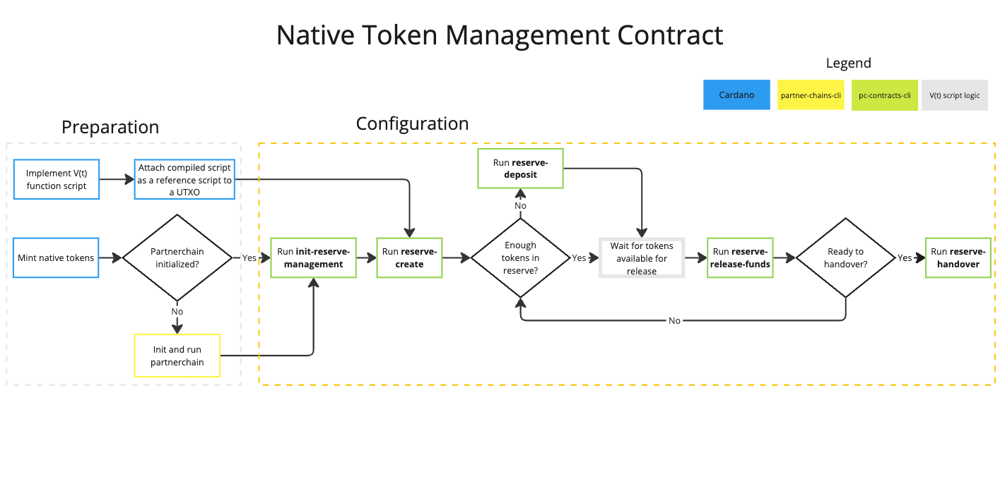
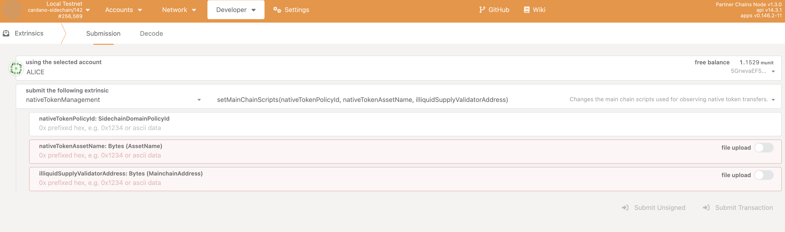

# Setting up token management for a partner chain

This guide shows you how to set up and manage a token management contract on the Cardano blockchain, enabling proper observability on partner chains. 
This guide presents the step-by-step process involving interactions with both the Cardano and the partner chain blockchain.



# Prerequisites

- **Cardano Node Setup:** A running Cardano node to interact with the Cardano blockchain

- **Partner Chain Node Setup:** Access to a partner chain node, including Ogmios and Kupo.

- **Development Environment:** Haskell and related tools installed for running scripts.

- **Access to Repositories:** Clone the following repositories:

   - [Partner Chains](https://github.com/input-output-hk/partner-chains)

   - [Partner Chains Smart Contracts](https://github.com/input-output-hk/partner-chains-smart-contracts)

- **Native Token Creation Knowledge:** Familiarity with creating Cardano native tokens.

- **Command-Line Tools:** Access to `pc-contracts-cli` (partner-chains-smart-contracts release binary) and `partner-chains-cli` (partner-chains release binary)

# Overview

This guide covers two main tasks: 

1. **On Cardano:** Creating your new token and setting up rules for how tokens are released over time.

2. **On your partner chain:** Connecting your partner chain to track the token and enable token operations across both chains. 

After you complete the steps in this guide, you will have a fully functioning token system that works across Cardano and your partner chain.

# 1. Setting up your token on Cardano

## 1.1 Creating a native token

Objective: Create a Cardano native token within your partner chain ecosystem.

### Steps

This step is outside the scope of partner chains and requires following the standard procedure for creating Cardano native tokens. 
Please see: [Minting Native Assets](https://developers.cardano.org/docs/native-tokens/minting/) on the Cardano Developer Portal for details. 
Generally speaking, however, the process includes these  steps:

1. Defining the token policy: establishing the monetary policy script for your token.

2. Minting the token: using the Cardano CLI to mint the token according to your policy.

3. Recording the token details:

   - Policy ID: The identifier of the token policy.

   - Asset Name: The name of the token in hexadecimal.

## 1.2 Configuring token release schedule

### 1.2.1 Implementing V(t) release function

Understanding `V` function:

- Purpose: The `V` function defines the schedule and amount of token `A` that moves from the reserve supply to the circulating supply over time.

- User Responsibility: You need to provide the logic for `V`, which determines how tokens are released. 

   - This logic can be written using native or Plutus scripts as well as Aiken scripts. The code should be compiled and attached as a reference script to UTXO.

- You can check the [example V-function](https://github.com/input-output-hk/partner-chains-smart-contracts/blob/master/onchain/src/TrustlessSidechain/ExampleVFunction.hs) in the partner-chains-smart-contracts repository.

After compilation, include the script as a CBOR in the reference.json:

```bash
{
	"cborHex": "59072659072301000033233223222...",
	"description":"<DESCRIPTION>",
	"type":"PlutusScriptV2"
}
```

Submit the transaction with the compiled `V(t)` release function:

```bash
cardano-cli conway transaction build \
--tx-in TX#TX_ID \
--tx-out OUT_ADDRESS+FEE \
--tx-out-reference-script-file reference.json \
--change-address CHANGE_ADDRESS --testnet-magic 2 --out-file tx

cardano-cli conway transaction sign \
--tx-body-file tx \
--signing-key-file <PaymentSigningKeyFile> \
--testnet-magic 2 \
--out-file tx.signed

cardano-cli conway transaction submit --tx-file tx.signed --testnet-magic 2
```

### Steps

1. Implement V-function (see [example V-function](https://github.com/input-output-hk/partner-chains-smart-contracts/blob/master/onchain/src/TrustlessSidechain/ExampleVFunction.hs) in the partner-chains-smart-contracts repository). 

2. Compile V-function script.

3. Include the script as a CBOR in the reference.json.

4. Add reference.json to the transaction and submit it to Cardano. 

5. Find and note hash#id for the transaction that has V-function script attached.

## 1.3 Initializing token reserve controls

Objective: Initialize the reserve management system for your token.

### 1.3.1 Run `init-reserve-management` command

Command template:

```bash
./pc-contracts-cli init-reserve-management \
--genesis-utxo <GenesisCommitteeHashUTxO> \
--ogmios-host <Ogmios_Host> \
--ogmios-port <Ogmios_Port> \
--kupo-host <Kupo_Host> \
--kupo-port <Kupo_Port> \
--payment-signing-key-file <PaymentSigningKeyFile> \
--network testnet
```

### Steps

1. Execute the `init-reserve-management` command.

2. Confirm initialization: Ensure that the `InitReserveManagement` scripts are correctly initialized by checking the command output.

## 1.4 Creating your token reserve

Objective: Create a reserve for your token and define the release function `V`.

### 1.4.1 Run `reserve-create` command

Command template:

```bash
/pc-contracts-cli reserve-create \
  --genesis-utxo <GenesisCommitteeHashUTxO> \
  --total-accrued-function-script-hash <VFunctionScriptHash> \
  --reserve-posixtime-t0 <POSIXTimeT0> \
  --reserve-asset-script-hash <ReserveAssetScriptHash> \
  --reserve-asset-name <ReserveAssetName> \
  --reserve-initial-deposit-amount <InitialDepositAmount> \
  --ogmios-host <Ogmios_Host> \
  --ogmios-port <Ogmios_Port> \
  --kupo-host <Kupo_Host> \
  --kupo-port <Kupo_Port> \
  --payment-signing-key-file <PaymentSigningKeyFile> \
  --network <Network>
```

#### Example command

```bash
/pc-contracts-cli reserve-create \
  --genesis-utxo b88dd63b770357e58c30d17f364a7b681a8fd52f721614db35977594 \
  --total-accrued-function-script-hash e833119231cabfc4de0733b05e0889a736373079c414a1b8c9ae6ac0 \
  --reserve-posixtime-t0 1729851426 \
  --reserve-asset-script-hash 55e8a5e0df12e794f2e78f55848c7cbd8f6de9a23be16be98d769116 \
  --reserve-asset-name 416c657854657374546f6b656e \
  --reserve-initial-deposit-amount 1000000 \
  --payment-signing-key-file payment.skey \
  --ogmios-host localhost \
  --ogmios-port 1337 \
  --kupo-host localhost \
  --kupo-port 1442 \
  --network testnet
```

#### Explanation of parameters

* `--genesis-utxo`: The genesis UTXO of the running partnerchain.

* `--network`: The network you operate on (`testnet` or `mainnet`).

* `--total-accrued-function-script-hash`: The script hash of your `V` function.

* `--reserve-posixtime-t0`: an integer that could possibly be used by user defined `V` function. It will be written into PlutusData of UTXO at Reserve Validator. Deprecated. This field will be set to 0 in the future versions of CLI.

* `--reserve-asset-script-hash`: The script hash of the reserve asset (policy ID).

* `--reserve-asset-name`: The asset name in hexadecimal.

* `--reserve-initial-deposit-amount`: The initial amount of tokens to deposit into the reserve.

* `--payment-signing-key-file`: Your payment signing key file for transaction signing.

### Steps

1. Prepare the parameters: Replace the placeholders with your actual values.

2. Execute the command: Run the `reserve-create` command with your parameters.

3. Confirm initialization: Ensure that the reserve initialization transaction has been confirmed by checking the command output.

## 1.5 Releasing tokens from reserve to circulation

Objective: Release available reserve tokens (defined by the `V` function).

### 1.5.1 Run the `reserve-release-funds` command

#### Command template

```bash
./pc-contracts-cli reserve-release-funds \
--genesis-utxo <GenesisCommitteeHashUTxO> \
--ogmios-host localhost \
--ogmios-port 1337 \
--kupo-host localhost \
--kupo-port 1442 \
--payment-signing-key-file <PaymentSigningKeyFile> \
--network <Network> \
--reserve-transaction-input 156803a18a4dbde48dc83a21b8b1007b693cdf096b73596252745fdef1de6414#0 \
--total-accrued-till-now 5
```

#### Explanation of parameters

* `--genesis-utxo`: The genesis UTXO of the running partnerchain

* `--network`: The network you operate on (`testnet` or `mainnet`)

* `--payment-signing-key-file`: Your payment signing key file for transaction signing

* `--reserve-transaction-input`: UTXO where `V` function script is attached as a reference

* `--total-accrued-till-now`: amount of tokens to release 

   - The number should be calculated as `number of tokens release up to this time + amount of tokens to release`

   - If 10 tokens have already been released and you want to release 10 more, then the total accrued until now should be defined as 20. 

   - Ensure you have enough tokens to release in this time frame (the `V` function defines release logic). 

### Steps

1. Execute the `reserve-release-funds` command.

2. Confirm completion: make sure that the release process has been completed by checking the command output.

## 1.6 Transferring token control to smart contracts

Objective: Complete the reserve setup by handing over control to the appropriate scripts.

### 1.6.1 Run the `reserve-handover` command

#### Command template

```bash
./pc-contracts-cli reserve-handover \
  --genesis-utxo <GenesisCommitteeHashUTxO> \
  --ogmios-host <Ogmios_Host> \
  --ogmios-port <Ogmios_Port> \
  --kupo-host <Kupo_Host> \
  --kupo-port <Kupo_Port> \
  --payment-signing-key-file <PaymentSigningKeyFile> \
  --network <Network>
  --hand-over
```

### Steps

1. Execute the `reserve-handover` command.

2. Confirm completion: Make sure that the handover process has been completed and the illiquid circulation supply transaction has been confirmed by checking the command output.

## 1.7 Initializing token reserve with initial deposit

Objective: Configure the initial token reserve by depositing a specified amount of tokens into the reserve contract.

### 1.7.1 Run the `reserve-deposit` command (optional)

#### Command template

```bash
./pc-contracts-cli reserve-deposit \
--genesis-utxo <GenesisCommitteeHashUTxO> \
--deposit-reserve-asset c1ad57f3e3e6e69562cd2236fe05b4494bb4826269c3d0c7e1123220 \
--reserve-asset-name 54657374546f6b656e30313039 \
--reserve-initial-deposit-amount 100 \
--ogmios-host localhost \
--ogmios-port 1337 \
--kupo-host localhost \
--kupo-port 1442 \
--payment-signing-key-file <PaymentSigningKeyFile> \
--network <Network>
```

#### Explanation of parameters

* `--genesis-utxo`: The genesis UTXO of the running partner chain

* `--network`: The network you operate on (for example, `testnet` or `mainnet`)

* `--payment-signing-key-file`: Your payment signing key file for transaction signing

* `--deposit-reserve-asset`: The script hash of the reserve asset (policy ID)

* `--reserve-asset-name`: The asset name in hexadecimal

* `--reserve-initial-deposit-amount`: The amount of tokens to deposit into the reserve

### Steps

1. Replace the placeholder values with your specific configuration parameters.

2. Execute the `reserve-deposit` command.

3. Verify that the deposit completed successfully by checking the command output status.

# 2. Connecting your token to your partner chain

## 2.1 Gathering required token parameters

Objective: Collect the essential parameters needed to configure the native token management contract on the partner chain.

### Required parameters

- NATIVE_TOKEN_POLICY_ID - the policy ID from Step 1.1.

- NATIVE_TOKEN_ASSET_NAME - the asset name from Step 1.1.

- ILLIQUID_SUPPLY_VALIDATOR_ADDRESS - can be obtained from the output of the `addresses` command (see below). 

### 2.1.1 Retrieving the validator address

Execute the `addresses` command: 

```bash
./pc-contracts-cli addresses \
--genesis-utxo <GenesisCommitteeHashUTxO> \
  --ogmios-host <Ogmios_Host> \
  --ogmios-port <Ogmios_Port> \
  --kupo-host <Kupo_Host> \
  --kupo-port <Kupo_Port> \
  --payment-signing-key-file <PaymentSigningKeyFile> \
  --network <Network>
```

Locate the validator address in the command output: 

```bash
{
  "endpoint": "GetAddrs",
  "addresses": {
    ...
    "IlliquidCirculationSupplyValidator": "<ADDRESS>"
  },
  ...
}
```

## 2.2 Following the Native Token Migration Guide

Objective: Migrate and synchronize the token state between Cardano and the partner chain.

### Steps

1. Open the [Native Token Migration Guide](https://github.com/input-output-hk/partner-chains/blob/master/docs/developer-guides/native-token-migration-guide.md).

2. Follow each step outlined in the guide.

3. Verify synchronization by checking that the token state is appropriately observed on the partner chain.

## 2.3 Updating current native token management configuration (optional)

Objective: Update native token configuration if migration has already happened.

**Warning:** The following steps need to be executed by the Governance Authority via a sudo account at PolkadotUI.

### Steps

1. Run `set_main_chain_scripts` extrinsic on the nativeTokenManagement pallet via the Polkadot UI portal to set the native token `policy ID`, `asset name`, and `illiquid supply validator address`. 



2. After submitting a transaction, the native token configuration can be checked via the Polkadot UI portal: Developer → Chain State

   - `selected state query`: nativeTokenManagement → mainchainScriptsConfiguration

Example native token configuration:

```bash
{
  nativeTokenPolicyId: 0x0000000
  nativeTokenAssetName: YOUR_TOKEN_NAME
  illiquidSupplyValidatorAddress: addr_....
}
```

# Notes

* The partner chains node follows any token movements on the illiquid supply validator address once the block becomes stable on Cardano (it is based on the `securityParam` of Cardano).
