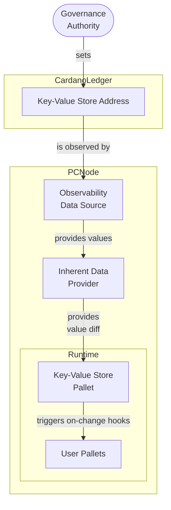

# Governed Map

Crates in this folder implement the Substrate components supporting the Governed Map features
of the Partner Chains Toolkit.

## Purpose

The Governed Map feature enables Partner Chains builders to maintain a mapping from string keys to arbitrary
binary data on the Cardano ledger. This data can be set, modified and deleted using the common Partner Chains
governance mechanism, and is exposed to the Partner Chain's runtime through a dedicated pallet, based on direct
observation of the Cardano state. Thanks to this, the mechanism provides a secure store for operational
parameters, configuration and other information that is beneficial to store on the main chain, but is required
by the Partner Chain itself.

## Data format

Each stored entry consists of:
- a key, which is a UTF-8 string
- a value, which is an arbitrary byte string

The binary values stored are not interpreted in any way by the mechanism

## Architecture and operation

The feature is implemented by 3 main components:
1. Plutus scripts governing the creation, modification and deletion of entries in the Governed Map, along with
   the offchain commands necessary to create and submit transactions. These scripts determine a single
   Cardano address where the UTXOs containing the key-value entries are stored.
2. Inherent data provider, along with its Cardano observability data source, that monitors the key-value
   store's Cardano address for changes, and emits inherent data with the summary of these changes (inserts,
   updates, deletions).
3. A pallet, which stores the current values of all the mappings and updates them via an inherent whenever
   a diff inherent data is produced. This pallet also exposes hooks for downstream pallets to register to be
   notified about changes in the mapped values.

The general flow of data can be seen in the following diagram:

