# Address Associations Pallet

## Overview

The Address Associations pallet provides functionality to create and maintain verifiable associations between mainchain (i.e., Cardano) stake public keys and partner chain addresses. This forms a critical link between the main chain and the partner chain, enabling cross-chain identity verification and operations.

## Purpose

This pallet serves several key purposes:
1. Establishes verifiable links between mainchain identities and partner chain addresses
2. Enables cross-chain validation of key ownership through cryptographic signatures
3. Provides a foundation for permission-based operations that require mainchain identity verification
4. Maintains a registry of associations that other pallets can query and use

## Primitives

This pallet uses primitives defined in the Substrate blockchain framework along with custom imports:

```rust
use parity_scale_codec::Encode;
use sidechain_domain::{StakePublicKey, UtxoId, MainchainKeyHash, StakeKeySignature};
use frame_support::pallet_prelude::*;
use frame_system::pallet_prelude::OriginFor;
```

## Configuration

The pallet has the following configuration trait:

```rust
#[pallet::config]
pub trait Config: frame_system::Config {
    /// Weight information for extrinsics in this pallet
    type WeightInfo: crate::weights::WeightInfo;

    /// Partner chain address type
    type PartnerChainAddress: Member + Parameter + MaxEncodedLen;

    /// Function to provide the genesis UTXO ID
    fn genesis_utxo() -> UtxoId;
}
```

## Storage

The pallet maintains a single storage map:

```rust
#[pallet::storage]
pub type AddressAssociations<T: Config> = StorageMap<
    Hasher = Blake2_128Concat,
    Key = MainchainKeyHash,
    Value = T::PartnerChainAddress,
    QueryKind = OptionQuery,
>;
```

This maps from a mainchain key hash to a partner chain address.

## API Specification

### Extrinsics

- **associate_address**: Associates a mainchain public key with a partner chain address
  ```rust
  pub fn associate_address(
      _origin: OriginFor<T>,
      partnerchain_address: T::PartnerChainAddress,
      signature: StakeKeySignature,
      stake_public_key: StakePublicKey,
  ) -> DispatchResult
  ```

### Public Functions (API)

- **get_version**: Returns the current pallet version
  ```rust
  pub fn get_version() -> u32
  ```

- **get_all_address_associations**: Returns an iterator over all mainchain-partnerchain address associations
  ```rust
  pub fn get_all_address_associations() -> impl Iterator<Item = (MainchainKeyHash, T::PartnerChainAddress)>
  ```

- **get_partner_chain_address_for**: Returns the partner chain address for a given mainchain public key if it exists
  ```rust
  pub fn get_partner_chain_address_for(stake_public_key: &StakePublicKey) -> Option<T::PartnerChainAddress>
  ```

### Inherent Data

This pallet does not use inherent data.

### Events

This pallet currently does not emit any events.

### Errors

```rust
#[pallet::error]
pub enum Error<T> {
    MainchainKeyAlreadyAssociated,
    InvalidMainchainSignature,
}
```

- `MainchainKeyAlreadyAssociated`: The mainchain key is already associated with a partner chain address
- `InvalidMainchainSignature`: The provided signature is invalid and cannot prove ownership of the stake key

## Integration Guide

To integrate this pallet in your runtime:

1. Add the pallet to your runtime's `Cargo.toml`:
```toml
[dependencies]
pallet-address-associations = { version = "4.0.0-dev", default-features = false }
```

2. Implement the pallet's Config trait for your runtime:
```rust
impl pallet_address_associations::Config for Runtime {
    type WeightInfo = pallet_address_associations::weights::SubstrateWeight<Runtime>;
    type PartnerChainAddress = AccountId;
    
    fn genesis_utxo() -> UtxoId {
        // Your implementation to provide the genesis UTXO ID
    }
}
```

3. Add the pallet to your runtime:
```rust
construct_runtime!(
    pub enum Runtime where
        Block = Block,
        NodeBlock = opaque::Block,
        UncheckedExtrinsic = UncheckedExtrinsic
    {
        // Other pallets
        AddressAssociations: pallet_address_associations::{Pallet, Call, Storage, Config},
    }
);
```

## Usage

To associate a mainchain stake public key with a partner chain address, the caller must:

1. Generate a signature using their mainchain stake key over a message containing:
    - The stake public key
    - The partner chain address
    - The genesis UTXO ID
2. Submit the `associate_address` extrinsic with their partner chain address, the signature, and their stake public key

The pallet verifies the signature to ensure the caller owns the mainchain stake key before creating the association.

The message that needs to be signed is structured as follows:
```rust
pub struct AddressAssociationSignedMessage<PartnerChainAddress> {
    pub stake_public_key: StakePublicKey,
    pub partnerchain_address: PartnerChainAddress,
    pub genesis_utxo: UtxoId,
}
```

## Architecture

### Runtime

Relationships between the `address-associations` pallet and other pallets in the system:


### Node

Relationships between the `address-associations` pallet and the node client:

```mermaid
graph TB
    classDef main fill:#f9d,stroke:#333,stroke-width:4px
    classDef consumer fill:#bbf,stroke:#333,stroke-width:2px

%% Node (positioned above)
    node[Partner Chain Node]:::consumer

%% Main pallet (in the middle)
    addressAssociations[pallet-address-associations]:::main

%% Relationships between node and address-associations pallet
    node -->|🧩 **uses** *Config* trait to configure pallet| addressAssociations
    node -->|👥 **calls** *associate_address* for mainchain-partnerchain linking| addressAssociations
    node -->|🔍 **queries** *get_partner_chain_address_for* to verify associations| addressAssociations
    node -->|🔍 **queries** *get_all_address_associations* for all registered links| addressAssociations
    node -->|📊 **uses** *get_version* to check pallet compatibility| addressAssociations
```



## Types

The pallet relies on several types imported from the `sidechain_domain` crate:
- `StakePublicKey`: Represents a mainchain stake public key
- `MainchainKeyHash`: A hash of a mainchain stake public key
- `StakeKeySignature`: A signature created using a mainchain stake key
- `UtxoId`: Identifier for a UTXO (Unspent Transaction Output)

## Dependencies

- frame_system
- frame_support
- sidechain_domain (for mainchain types)
- parity_scale_codec (for encoding/decoding)

## Security Considerations

- Signatures are verified cryptographically to prevent unauthorized associations
- Once created, associations cannot be modified through regular extrinsics (requires governance intervention)
- The pallet ensures that a mainchain key can only be associated with one partner chain address
- No events are emitted, which could make debugging and monitoring more challenging
- The pallet does not provide a way to remove or update associations once created