# Block Participation Pallet

A Substrate pallet for tracking block production participation in partner chains.

## Overview

The Block Participation pallet provides functionality to track block production by validators in a partner chain. It allows for recording block authors and delegators associated with each block, enabling reward distribution and governance systems to account for validator participation.

## Purpose

This pallet serves as a vital component in partner chain ecosystems by:
1. Tracking which validators are actively producing blocks
2. Recording delegator participation in block production
3. Providing an interface for other pallets to query block production data
4. Managing the release of historical block production data when it's no longer needed

## Primitives

This pallet uses primitives defined in the Substrate blockchain framework along with custom imports:

```rust
use codec::{Decode, Encode};
use frame_support::traits::Get;
use frame_system::ensure_signed;
use scale_info::TypeInfo;
use sp_block_participation::*;
use sp_runtime::{
    traits::{Member, Parameter},
    RuntimeAppPublic,
};
use sp_std::{collections::btree_map::BTreeMap, prelude::*, vec};
```

## Configuration

This pallet has the following configuration trait:

```rust
pub trait Config: frame_system::Config {
    /// Weight information for extrinsics in this pallet
    type WeightInfo: crate::weights::WeightInfo;
    
    /// The type used to identify block authors
    type BlockAuthor: Member + Parameter + MaxEncodedLen;
    
    /// The type used to identify delegators
    type DelegatorId: Member + Parameter + MaxEncodedLen;
    
    /// A function that determines whether data for a specific slot should be released
    fn should_release_data(slot: Slot) -> Option<Slot>;
    
    /// A function that provides an iterator of blocks produced up to a given slot
    fn blocks_produced_up_to_slot(slot: Slot) -> impl Iterator<Item = (Slot, Self::BlockAuthor)>;
    
    /// A function that discards block production data up to a specified slot
    fn discard_blocks_produced_up_to_slot(slot: Slot);
    
    /// The inherent identifier used for this pallet
    const TARGET_INHERENT_ID: InherentIdentifier;
}
```

## API Specification

### Extrinsics

#### `note_processing`

Processes block production data from an inherent, recording block authors and delegator participation.

```rust
pub fn note_processing(origin: OriginFor<T>, data: InherentData) -> DispatchResult
```

### Public Functions

#### `should_release_data`

Determines if block production data should be released for a given slot.

```rust
pub fn should_release_data(slot: Slot) -> Option<Slot>
```

### Inherent Data

This pallet uses inherent data to provide block production information to the chain. The inherent data has the following structure:

```rust
pub struct InherentData {
    pub processed_up_to_slot: Slot,
    pub participation_maps: BTreeMap<Slot, ParticipationMap<BlockAuthor, DelegatorId>>,
}
```

## Integration Guide

To integrate this pallet in your runtime:

1. Add the pallet to your runtime's `Cargo.toml`:
```toml
[dependencies]
pallet-block-participation = { version = "4.0.0-dev", default-features = false }
```

2. Implement the pallet's Config trait for your runtime:
```rust
impl pallet_block_participation::Config for Runtime {
    type WeightInfo = pallet_block_participation::weights::SubstrateWeight<Runtime>;
    type BlockAuthor = AccountId;
    type DelegatorId = AccountId;
    
    fn should_release_data(slot: Slot) -> Option<Slot> {
        // Your implementation
    }
    
    fn blocks_produced_up_to_slot(slot: Slot) -> impl Iterator<Item = (Slot, Self::BlockAuthor)> {
        // Your implementation
    }
    
    fn discard_blocks_produced_up_to_slot(slot: Slot) {
        // Your implementation
    }
    
    const TARGET_INHERENT_ID: InherentIdentifier = *b"blkparti";
}
```

3. Add the pallet to your runtime:
```rust
construct_runtime!(
    pub enum Runtime where
        Block = Block,
        NodeBlock = opaque::Block,
        UncheckedExtrinsic = UncheckedExtrinsic
    {
        // Other pallets
        BlockParticipation: pallet_block_participation::{Pallet, Call, Storage, Inherent},
    }
);
```

## Implementation Details

This pallet relies on external storage for tracking block production data. The actual storage of block authors and delegator participation is expected to be handled by the runtime implementation through the Config trait methods.

The pallet processes block production data through inherents, which should be created and supplied by the runtime during block production.

## Architecture

### Runtime

Relationships between the `block-participation` pallet and other pallets in the system:


### Node

Relationships between the `block-participation` pallet and the node client:

```mermaid
graph TB
classDef main fill:#f9d,stroke:#333,stroke-width:4px
classDef consumer fill:#bbf,stroke:#333,stroke-width:2px
classDef dependency fill:#ddd,stroke:#333,stroke-width:1px

%% Node (positioned above)
node[Partner Chain Node]:::consumer

%% Main pallet (in the middle)
blockParticipation[pallet-block-participation]:::main

%% Relationships between node and block-participation pallet
node -->|🔍 **uses** *should_release_data* to determine when to clear historical data| blockParticipation
node -->|🔍 **calls** *blocks_produced_up_to_slot* to retrieve block production data| blockParticipation
node -->|📝 **processes** *note_processing* for block participation inherents| blockParticipation
node -->|🧩 **provides** *InherentData* structure with participation maps| blockParticipation

%% Relationships that block-participation exposes to the node
blockParticipation -->|🔍 **exposes** *participation_maps* for block rewards calculation| node
blockParticipation -->|📝 **requires** *TARGET_INHERENT_ID* for inherent processing| node
blockParticipation -->|🧩 **uses** *BlockAuthor* to identify block producers| node
blockParticipation -->|🧩 **uses** *DelegatorId* to track delegator participation| node
```

