# Block Production Log Pallet

A Substrate pallet for recording and maintaining historical data of block production in partner chains.

## Overview

The Block Production Log pallet maintains a chronological record of which validators have produced blocks at specific slots throughout the blockchain's lifetime. This historical record serves as the source of truth for validator participation in the network's consensus process and forms the empirical basis for several critical network functions.

## Purpose

This pallet serves several important purposes in the partner chain ecosystem:

1. Maintaining a chronological record of block production by validators
2. Providing historical data for reward calculations
3. Supporting analysis of validator performance over time
4. Enabling efficient pruning of historical data to manage state growth
5. Forming the foundation for fair reward distribution based on participation

## Primitives

This pallet uses primitives defined in the Substrate blockchain framework along with custom imports:

```rust
use codec::{Decode, Encode};
use frame_support::{pallet_prelude::*, traits::Get};
use frame_system::pallet_prelude::*;
use scale_info::TypeInfo;
use sp_runtime::{
    traits::{AtLeast32BitUnsigned, Member, Parameter},
    RuntimeAppPublic,
};
use sp_std::{fmt::Debug, prelude::*};
```

## Configuration

This pallet has the following configuration trait:

```rust
#[pallet::config]
pub trait Config: frame_system::Config {
    /// The overarching event type.
    type RuntimeEvent: From<Event<Self>> + IsType<<Self as frame_system::Config>::RuntimeEvent>;

    /// Type representing a block producer ID, which is recorded in the block production log.
    type BlockProducerId: Parameter + Member + Copy + MaybeSerializeDeserialize + Debug + MaxEncodedLen
    + TypeInfo + Ord;

    /// Type representing a block slot.
    type Slot: Parameter + Member + Copy + AtLeast32BitUnsigned + MaybeSerializeDeserialize
    + Default + Debug + TypeInfo + Ord;
}
```

## Storage

The pallet maintains several storage items:

1. `BlockProductionLogEntries`: A map of slots to block producers who created blocks at those slots
2. `BlockProductionLogBoundary`: Optional slot boundary marking the earliest slot in the log

## API Specification

### Extrinsics

#### `append`

Appends the block producer to the production log for a specific slot.

```rust
pub fn append(origin: OriginFor<T>, block_producer: T::BlockProducerId, slot: T::Slot) -> DispatchResult
```

### Public Functions

#### `take_prefix`

Returns and removes block production data up to the given slot.

```rust
pub fn take_prefix(slot: T::Slot) -> Vec<(T::Slot, T::BlockProducerId)>
```

#### `peek_prefix`

Returns an iterator of block production data up to the given slot without removing it.

```rust
pub fn peek_prefix(slot: T::Slot) -> Vec<(T::Slot, T::BlockProducerId)>
```

#### `drop_prefix`

Removes block production data up to the given slot.

```rust
pub fn drop_prefix(slot: T::Slot) -> DispatchResult
```

### Inherent Data

This pallet uses inherent data to provide block production information to the chain.

#### Inherent Identifier
```rust
pub const INHERENT_IDENTIFIER: InherentIdentifier = *b"blprdlog";
```

#### Data Type
`T::BlockProducerId` - The ID of the block producer who created the current block

The pallet verifies this inherent data to ensure blocks include information about who produced them.

### Events

- `Appended(T::BlockProducerId, T::Slot)`: Emitted when a block producer is appended to the log for a specific slot.
- `Dropped(T::Slot)`: Emitted when production data is dropped up to a specific slot.

### Errors

- `NoBlocksToTake`: Attempted to take blocks but no blocks were available in the specified range
- `InvalidSlotBoundary`: Attempted to set an invalid slot boundary in the block production log

## Hooks

The Block Production Log pallet implements the `on_initialize` hook which is called at the beginning of each block's execution:

```rust
fn on_initialize(n: BlockNumberFor<T>) -> Weight {
    // Sets up the verification context for the current block
    // Initializes the expected block producer for the current slot
    // Returns the appropriate weight for this operation
}
```

This hook ensures that each block's inherent data can be properly verified against the expected block production schedule.

## Integration

To integrate this pallet in your runtime:

1. Add the pallet to your runtime's `Cargo.toml`:
```toml
[dependencies]
pallet-block-production-log = { version = "4.0.0-dev", default-features = false }
```

2. Implement the pallet's Config trait for your runtime:
```rust
impl pallet_block_production_log::Config for Runtime {
    type RuntimeEvent = RuntimeEvent;
    type BlockProducerId = AccountId;
    type Slot = u64;
}
```

3. Add the pallet to your runtime:
```rust
construct_runtime!(
    pub enum Runtime where
        Block = Block,
        NodeBlock = opaque::Block,
        UncheckedExtrinsic = UncheckedExtrinsic
    {
        // Other pallets
        BlockProductionLog: pallet_block_production_log::{Pallet, Call, Storage, Event<T>},
    }
);
```

## Usage

The Block Production Log pallet is typically used in conjunction with the consensus mechanism and block participation tracking. The typical usage flow is:

1. For each block, the `append` function is called (usually via inherent data) to record which validator produced the block at the current slot.

2. Periodically, other pallets (such as a rewards pallet) can call `peek_prefix` to examine historical block production data without removing it.

3. After historical data has been fully processed (typically determined by the Block Participation pallet), the `drop_prefix` function can be called to prune old data and manage storage growth.

4. The `take_prefix` function combines retrieval and pruning in a single operation for cases where data will be processed immediately and then no longer needed.

## Integration

This pallet is designed to work closely with the Block Participation pallet:

1. The Block Production Log pallet maintains the raw history of block production.
2. The Block Participation pallet tracks when this history has been processed (e.g., for rewards).
3. Once processed, the Block Participation pallet signals that historical data can be pruned via the `drop_prefix` function.

This separation of concerns creates a clean architecture that separates record-keeping from record processing.

### Runtime

Relationships between the `block-production-log` pallet and other pallets in the system:

```mermaid
graph TB
    classDef main fill:#f9d,stroke:#333,stroke-width:4px
    classDef consumer fill:#bbf,stroke:#333,stroke-width:2px
    classDef dependency fill:#ddd,stroke:#333,stroke-width:1px

%% Pallets that depend on block-production-log (positioned above)
    blockParticipation[pallet-block-participation]:::consumer

%% Main pallet (in the middle)
    blockProductionLog[pallet-block-production-log]:::main

%% Dependencies (positioned below)
    frameSystem[frame_system]:::dependency
    spRuntimePrimitives[sp_runtime]:::dependency
    consensus[consensus_mechanism]:::dependency

%% Relationships for pallets that depend on block-production-log
    blockParticipation -->|🔍 **uses** *peek_prefix* to retrieve block production data| blockProductionLog
    blockParticipation -->|🔍 **calls** *drop_prefix* to prune processed data| blockProductionLog
    blockParticipation -->|🔍 **calls** *take_prefix* to process and remove historical data| blockProductionLog

%% Relationships for dependencies
    blockProductionLog -->|📝 **implements** *on_initialize* hook for block verification| frameSystem
    blockProductionLog -->|🧩 **uses** *Parameter*, *Member*, and *AtLeast32BitUnsigned* traits| spRuntimePrimitives
    blockProductionLog -->|👥 **receives** *BlockProducerId* data via inherent data| consensus
```



### Node

Relationships between the `block-production-log` pallet and the node client:

```mermaid
graph TB
    classDef main fill:#f9d,stroke:#333,stroke-width:4px
    classDef consumer fill:#bbf,stroke:#333,stroke-width:2px
    classDef dependency fill:#ddd,stroke:#333,stroke-width:1px

%% Main pallet (in the middle)
    blockProductionLog[pallet-block-production-log]:::main

%% Node component (positioned above)
    node[node/node]:::consumer

%% Relationships between node and the pallet
    node -->|👥 **uses** *BlockAuthorInherentProvider* for block producer identification| blockProductionLog
    node -->|📝 **initializes** *BlockAuthorInherentProvider* in inherent data creation| blockProductionLog
    node -->|🔍 **retrieves** *BlockProducerId* for block verification| blockProductionLog
    node -->|🧩 **integrates** *INHERENT_IDENTIFIER* for block production data| blockProductionLog
    node -->|🔍 **calls** *append* through inherent data handling| blockProductionLog
```


