# Native Token Management Pallet

A Substrate pallet for enabling cross-chain native token transfers from Cardano (main chain) to partner chains.

## Overview

The Native Token Management pallet provides mechanisms to facilitate the observation and processing of native token transfers from the main chain (Cardano) to partner chains. It establishes a notion of liquid and illiquid supply of the native token on Cardano, represented as native tokens being either freely available in user accounts or locked under a designated illiquid supply address.

When tokens are sent to the illiquid supply address on Cardano, this signals that an equivalent amount of tokens should be made available on the Partner Chain. The pallet consumes inherent data containing information about these transfers and triggers customizable logic to handle their movement on the partner chain side.

## Purpose

This pallet serves several critical purposes in the partner chain ecosystem:

1. Enabling cross-chain native token movements between Cardano and partner chains
2. Providing a configurable mechanism for handling token transfers
3. Maintaining information about the main chain scripts (policy ID, asset name, validator address)
4. Processing inherent data about token transfers from the main chain
5. Supporting customizable token transfer handling logic through the `TokenTransferHandler` trait
6. Tracking initialization status to determine when historical data needs to be queried

## Primitives

This pallet uses primitives defined in the Substrate blockchain framework along with custom imports:

```rust
use frame_support::pallet_prelude::*;
use frame_system::pallet_prelude::*;
use sidechain_domain::*;
use sp_native_token_management::*;
```

## Configuration

This pallet has the following configuration trait:

```rust
#[pallet::config]
pub trait Config: frame_system::Config {
    type RuntimeEvent: From<Event<Self>> + IsType<<Self as frame_system::Config>::RuntimeEvent>;

    type TokenTransferHandler: TokenTransferHandler;
    type WeightInfo: WeightInfo;
}
```

Where `TokenTransferHandler` is defined as:

```rust
pub trait TokenTransferHandler {
    fn handle_token_transfer(token_amount: NativeTokenAmount) -> DispatchResult;
}
```

## Storage

The pallet maintains several storage items:

1. `MainChainScriptsConfiguration`: Stores configuration information about the Cardano scripts (policy ID, asset name, validator address)
2. `Initialized`: Tracks whether the pallet has been initialized, which determines if historical data needs to be queried

## API Specification

### Extrinsics

#### `transfer_tokens`

Processes a token transfer from the main chain to the partner chain by calling the configured `TokenTransferHandler`.

```rust
pub fn transfer_tokens(origin: OriginFor<T>, token_amount: NativeTokenAmount) -> DispatchResult
```

#### `set_main_chain_scripts`

Changes the main chain scripts used for observing native token transfers.

```rust
pub fn set_main_chain_scripts(
    origin: OriginFor<T>,
    native_token_policy_id: PolicyId,
    native_token_asset_name: AssetName,
    illiquid_supply_validator_address: MainchainAddress,
) -> DispatchResult
```

### Public Functions

#### `get_main_chain_scripts`

Returns the current main chain scripts configuration.

```rust
pub fn get_main_chain_scripts() -> Option<sp_native_token_management::MainChainScripts>
```

#### `initialized`

Returns the current initialization status.

```rust
pub fn initialized() -> bool
```

### Inherent Data

This pallet uses inherent data to provide token transfer information from the main chain.

#### Inherent Identifier
```rust
pub const INHERENT_IDENTIFIER: InherentIdentifier = *b"nattoken";
```

#### Data Type
`TokenTransferData` - Contains information about the amount of tokens transferred

The pallet verifies this inherent data to ensure tokens are transferred correctly.

### Events

- `TokensTransfered(NativeTokenAmount)`: Emitted when tokens are transferred to the partner chain.

### Errors

- `TokenTransferNotHandled`: Inherent data for token transfer exists but was not handled
- `IncorrectTokenNumberTransfered`: The token amount in the inherent extrinsic does not match the expected amount
- `UnexpectedTokenTransferInherent`: Unexpected token transfer inherent extrinsic when none was expected

## Architecture

### Runtime

Relationships between the `native-token-management` pallet and other components in the system:

```mermaid
graph TB
    classDef main fill:#f9d,stroke:#333,stroke-width:4px
    classDef consumer fill:#bbf,stroke:#333,stroke-width:2px
    classDef dependency fill:#ddd,stroke:#333,stroke-width:1px

%% Main pallet (in the middle)
    nativeTokenManagement[pallet-native-token-management]:::main

%% Dependencies (positioned below)
    frameSupport[frame-support]:::dependency
    frameSystem[frame-system]:::dependency
    sidechainDomain[sidechain-domain]:::dependency
    spNativeTokenManagement[sp-native-token-management]:::dependency

%% Relationships for dependencies
    nativeTokenManagement -->|🧩 **uses** *MainchainAddress*, *PolicyId*, *AssetName* types| sidechainDomain
    nativeTokenManagement -->|🧩 **uses** *MainChainScripts*, *NativeTokenAmount* types| spNativeTokenManagement
    nativeTokenManagement -->|📝 **uses** *StorageValue*, *DispatchResult* for storage and error handling| frameSupport
    nativeTokenManagement -->|📝 **implements** *ProvideInherent* trait for inherent data handling| frameSupport
    nativeTokenManagement -->|📝 **uses** *ensure_none*, *ensure_root* for origin checking| frameSystem
    nativeTokenManagement -->|📝 **depends on** *Event* and *Config* trait for runtime integration| frameSystem
```



### Node

Relationships between the `native-token-management` pallet and the node client:

```mermaid
graph TB
    classDef main fill:#f9d,stroke:#333,stroke-width:4px
    classDef consumer fill:#bbf,stroke:#333,stroke-width:2px

%% Node (positioned above)
    node[Partner Chain Node]:::consumer

%% Main pallet (in the middle)
    nativeTokenManagement[pallet-native-token-management]:::main

%% Relationships between node and pallet
    node -->|🔍 **uses** *get_main_chain_scripts* to retrieve native token configuration| nativeTokenManagement
    node -->|📝 **implements** *NativeTokenManagementDataSource* trait for main chain connectivity| nativeTokenManagement
    node -->|🔄 **provides** *NativeTokenManagementInherentDataProvider* for block production| nativeTokenManagement
    node -->|👥 **calls** *set_main_chain_scripts* via governance or sudo for configuration| nativeTokenManagement
    node -->|💰 **processes** *TokenTransferData* for native token movement| nativeTokenManagement
```



## Integration

To integrate this pallet in your runtime:

1. Add the pallet to your runtime's `Cargo.toml`:
```toml
[dependencies]
pallet-native-token-management = { version = "4.0.0-dev", default-features = false }
sp-native-token-management = { version = "4.0.0-dev", default-features = false }
```

2. Implement the `TokenTransferHandler` trait:
```rust
pub struct ExampleTokenTransferHandler;

impl TokenTransferHandler for ExampleTokenTransferHandler {
    fn handle_token_transfer(token_amount: NativeTokenAmount) -> DispatchResult {
        // Your custom logic for handling token transfers
        // For example, mint tokens, update balances, etc.
        Ok(())
    }
}
```

3. Implement the pallet's Config trait for your runtime:
```rust
impl pallet_native_token_management::Config for Runtime {
    type RuntimeEvent = RuntimeEvent;
    type TokenTransferHandler = ExampleTokenTransferHandler;
    type WeightInfo = pallet_native_token_management::weights::WeightInfo<Runtime>;
}
```

4. Add the pallet to your runtime:
```rust
construct_runtime!(
    pub enum Runtime where
        Block = Block,
        NodeBlock = opaque::Block,
        UncheckedExtrinsic = UncheckedExtrinsic
    {
        // Other pallets
        NativeTokenManagement: pallet_native_token_management,
    }
);
```

5. Configure the inherent data provider in your node's service:
```rust
let native_token_data_source = YourMainChainDataSource::new();

let native_token_inherent_provider = NativeTokenManagementInherentDataProvider::new(
    client.clone(),
    &native_token_data_source,
    latest_main_chain_hash,
    parent_hash,
).await?;

inherent_data_providers
    .register_provider(native_token_inherent_provider)
    .map_err(|e| format!("Failed to register inherent data provider: {:?}", e))?;
```

## Usage

The Native Token Management pallet is typically used as follows:

1. Configure the pallet with the appropriate main chain scripts (policy ID, asset name, validator address) either through genesis configuration or by calling `set_main_chain_scripts` via governance.

2. Implement the `TokenTransferHandler` trait with your custom logic for handling token transfers from the main chain to the partner chain.

3. The node service creates and registers the `NativeTokenManagementInherentDataProvider` to supply token transfer information from the main chain.

4. When tokens are transferred to the illiquid supply validator address on Cardano, the inherent data provider will detect this and include the information in the block.

5. The pallet processes the inherent data and calls the `TokenTransferHandler` to handle the token transfer on the partner chain side.

6. The `TokensTransfered` event is emitted to signal that tokens have been transferred.

**IMPORTANT**: This pallet only handles the amount of tokens moved and does not attach any metadata to the transfers. It is not a fully-featured token bridge on its own and needs to be combined with a separate sender-receiver metadata channel to implement a complete bridge.

## Migration

For adding this feature to an already running chain, refer to the migration guide in `docs/developer-guides/native-token-migration-guide.md`.
