# Native Token Management Primitives

A Substrate primitives crate for enabling cross-chain native token transfers from Cardano (main chain) to partner chains.

## Overview

The Native Token Management primitives crate provides fundamental types, traits, and utilities that facilitate the observation and processing of native token transfers from the main chain (Cardano) to partner chains. It serves as the foundation for the Native Token Management pallet, defining the core data structures, inherent data provider mechanisms, and runtime APIs necessary for cross-chain token transfers.

## Purpose

This primitives crate serves several critical purposes in the partner chain ecosystem:

1. Defining the core types for identifying and tracking native tokens on the main chain
2. Providing a mechanism to observe and verify token transfers across chains
3. Implementing the inherent data provider that fetches token transfer information
4. Defining runtime APIs for accessing native token management functionality
5. Establishing error handling for token transfer operations
6. Enabling a secure bridge between the main chain and partner chains

## Primitives

The crate uses primitives defined in the Substrate blockchain framework along with custom imports:

```rust
use parity_scale_codec::{Decode, Encode, MaxEncodedLen};
use sidechain_domain::*;
use sp_inherents::*;
use sp_runtime::scale_info::TypeInfo;
```

## Core Types

### MainChainScripts

The `MainChainScripts` struct defines the on-chain entities involved in native token management on Cardano:

```rust
#[derive(Default, Debug, Clone, PartialEq, Eq, TypeInfo, Encode, Decode, MaxEncodedLen)]
#[cfg_attr(feature = "serde", derive(serde::Serialize, serde::Deserialize))]
pub struct MainChainScripts {
    /// Minting policy ID of the native token
    pub native_token_policy_id: PolicyId,
    /// Asset name of the native token
    pub native_token_asset_name: AssetName,
    /// Address of the illiquid supply validator. All tokens sent to that address are effectively locked
    /// and considered "sent" to the Partner Chain.
    pub illiquid_supply_validator_address: MainchainAddress,
}
```

### TokenTransferData

Represents the transfer data for native tokens:

```rust
#[derive(Decode, Encode)]
pub struct TokenTransferData {
    pub token_amount: NativeTokenAmount,
}
```

### InherentError

Defines the possible errors that can occur during the inherent data processing:

```rust
#[derive(Encode, Debug, PartialEq)]
#[cfg_attr(feature = "std", derive(Decode, thiserror::Error))]
pub enum InherentError {
    #[cfg_attr(feature = "std", error("Inherent missing for token transfer of {0} tokens"))]
    TokenTransferNotHandled(NativeTokenAmount),
    #[cfg_attr(
        feature = "std",
        error("Incorrect token transfer amount: expected {0}, got {1} tokens")
    )]
    IncorrectTokenNumberTransfered(NativeTokenAmount, NativeTokenAmount),
    #[cfg_attr(feature = "std", error("Unexpected transfer of {0} tokens"))]
    UnexpectedTokenTransferInherent(NativeTokenAmount),
}
```

## Runtime API

The crate declares a runtime API for accessing native token management functionality:

```rust
sp_api::decl_runtime_apis! {
    pub trait NativeTokenManagementApi {
        fn get_main_chain_scripts() -> Option<MainChainScripts>;
        /// Gets current initializaion status and set it to `true` afterwards. This check is used to
        /// determine whether historical data from the beginning of main chain should be queried.
        fn initialized() -> bool;
    }
}
```

## Inherent Data

This crate defines the inherent data provider used to fetch token transfers from the main chain.

### Inherent Identifier
```rust
pub const INHERENT_IDENTIFIER: InherentIdentifier = *b"nattoken";
```

### NativeTokenManagementDataSource Trait

```rust
#[async_trait::async_trait]
pub trait NativeTokenManagementDataSource {
    /// Retrieves total of native token transfers into the illiquid supply in the range (after_block, to_block]
    async fn get_total_native_token_transfer(
        &self,
        after_block: Option<McBlockHash>,
        to_block: McBlockHash,
        scripts: MainChainScripts,
    ) -> Result<NativeTokenAmount, Box<dyn std::error::Error + Send + Sync>>;
}
```

### NativeTokenManagementInherentDataProvider

This provider is responsible for collecting token transfer information from the main chain and making it available to the runtime.

```rust
pub struct NativeTokenManagementInherentDataProvider {
    pub token_amount: Option<NativeTokenAmount>,
}
```

## Integration

To integrate this primitives crate in your runtime:

1. Add the crate to your runtime's `Cargo.toml`:
```toml
[dependencies]
sp-native-token-management = { version = "4.0.0-dev", default-features = false }
```

2. Implement the `NativeTokenManagementDataSource` trait to connect to your main chain data source:
```rust
pub struct YourMainChainDataSource {
    // Your implementation details
}

#[async_trait::async_trait]
impl NativeTokenManagementDataSource for YourMainChainDataSource {
    async fn get_total_native_token_transfer(
        &self,
        after_block: Option<McBlockHash>,
        to_block: McBlockHash,
        scripts: MainChainScripts,
    ) -> Result<NativeTokenAmount, Box<dyn std::error::Error + Send + Sync>> {
        // Implementation that connects to your main chain data source
        // and fetches the total native token transfers
    }
}
```

3. Create the inherent data provider in your node service:

```rust
let native_token_data_source = YourMainChainDataSource::new();

let native_token_inherent_provider = NativeTokenManagementInherentDataProvider::new(
    client.clone(),
    &native_token_data_source,
    latest_main_chain_hash,
    parent_hash,
).await?;

inherent_data_providers
    .register_provider(native_token_inherent_provider)
    .map_err(|e| format!("Failed to register inherent data provider: {:?}", e))?;
```

## Usage

The Native Token Management primitives are typically used as follows:

1. In the node implementation, you create and register the inherent data provider to supply token transfer information from the main chain.

2. The inherent data provider will query the main chain data source to determine if any tokens have been transferred to the illiquid supply address.

3. If tokens have been transferred, the provider will include this information as inherent data when a new block is authored.

4. The corresponding pallet in the runtime will process this inherent data and handle the token transfers on the partner chain side.

## Testing Support

For testing purposes, the crate includes a mock implementation of the `NativeTokenManagementDataSource` trait:

```rust
#[cfg(any(test, feature = "mock"))]
pub mod mock {
    pub struct MockNativeTokenDataSource {
        transfers: HashMap<(Option<McBlockHash>, McBlockHash), NativeTokenAmount>,
    }

    #[async_trait]
    impl NativeTokenManagementDataSource for MockNativeTokenDataSource {
        async fn get_total_native_token_transfer(
            &self,
            after_block: Option<McBlockHash>,
            to_block: McBlockHash,
            _scripts: MainChainScripts,
        ) -> Result<NativeTokenAmount, Box<dyn std::error::Error + Send + Sync>> {
            Ok(self.transfers.get(&(after_block, to_block)).cloned().unwrap_or_default())
        }
    }
}
```

## Integration

### Runtime

Relationships between the `native-token-management` pallet and other pallets in the system:



```mermaid
graph TB
    classDef main fill:#f9d,stroke:#333,stroke-width:4px
    classDef consumer fill:#bbf,stroke:#333,stroke-width:2px
    classDef dependency fill:#ddd,stroke:#333,stroke-width:1px

%% Main pallet (in the middle)
    nativeTokenManagement[pallet-native-token-management]:::main

%% Dependencies (positioned below)
    frameSupport[frame-support]:::dependency
    frameSystem[frame-system]:::dependency
    sidechainDomain[sidechain-domain]:::dependency
    spNativeTokenManagement[sp-native-token-management]:::dependency

%% Relationships for dependencies
    nativeTokenManagement -->|🧩 **uses** *MainchainAddress*, *PolicyId*, *AssetName* types| sidechainDomain
    nativeTokenManagement -->|🧩 **uses** *MainChainScripts*, *NativeTokenAmount* types| spNativeTokenManagement
    nativeTokenManagement -->|📝 **uses** *StorageValue*, *DispatchResult* for storage and error handling| frameSupport
    nativeTokenManagement -->|📝 **implements** *ProvideInherent* trait for inherent data handling| frameSupport
    nativeTokenManagement -->|📝 **uses** *ensure_none*, *ensure_root* for origin checking| frameSystem
    nativeTokenManagement -->|📝 **depends on** *Event* and *Config* trait for runtime integration| frameSystem
```

### Node

Relationships between the `native-token-management` pallet and the node client:


    

## Migration

See the guide in `docs/developer-guides/native-token-migration-guide.md` for how to add this feature to an already running chain.