# Partner Chains Session Pallet

A Substrate pallet for managing validator sessions and session keys in partner chains, adapted from Substrate's standard session pallet.

## Overview

The Partner Chains Session pallet is a specialized adaptation of Substrate's standard session pallet, customized for partner chains while maintaining compatibility with core Substrate functionalities. It manages the lifecycle of validator sessions, including rotation of validator sets and their associated session keys.

A "session" represents a period during which a fixed set of validators is responsible for block production and finality. When a session ends, the pallet can rotate to a new validator set, allowing the network to dynamically adjust its consensus participants.

## Purpose

This pallet serves several important purposes in the partner chain ecosystem:

1. Managing the lifecycle of validator sessions (creation, rotation, termination)
2. Facilitating orderly transitions between validator sets without disrupting consensus
3. Serving as the interface between validator selection logic and consensus mechanisms
4. Maintaining backward compatibility with Substrate components
5. Supporting the disabling of validators who misbehave
6. Managing validator session keys for consensus operations

## Primitives

This pallet uses primitives defined in the Substrate blockchain framework:

```rust
use frame_support::{
    traits::{
        EstimateNextNewSession, EstimateNextSessionRotation, OneSessionHandler,
        ValidatorRegistration,
    },
    weights::Weight,
};
use frame_system::pallet_prelude::BlockNumberFor;
use frame_system::DecRefStatus;
use sp_runtime::{traits::OpaqueKeys, DispatchError, KeyTypeId, RuntimeAppPublic};
use sp_staking::SessionIndex;
use sp_std::prelude::*;
```

## Configuration

This pallet has the following configuration trait:

```rust
#[pallet::config]
pub trait Config: frame_system::Config {
    /// The overarching event type.
    type RuntimeEvent: From<Event> + IsType<<Self as frame_system::Config>::RuntimeEvent>;

    /// A stable ID for a validator.
    type ValidatorId: Member
        + Parameter
        + MaybeSerializeDeserialize
        + MaxEncodedLen
        + Into<Self::AccountId>;

    /// Indicator for when to end the session.
    type ShouldEndSession: ShouldEndSession<BlockNumberFor<Self>>;

    /// Something that can predict the next session rotation. This should typically come from
    /// the same logical unit that provides [`ShouldEndSession`].
    type NextSessionRotation: EstimateNextSessionRotation<BlockNumberFor<Self>>;

    /// Handler for managing new session.
    type SessionManager: SessionManager<Self::ValidatorId, Self::Keys>;

    /// Handler when a session has changed.
    type SessionHandler: SessionHandler<Self::ValidatorId>;

    /// The keys.
    type Keys: OpaqueKeys + Member + Parameter + MaybeSerializeDeserialize;
}
```

## Storage

The pallet maintains several storage items:

1. `ValidatorsAndKeys`: A storage value that stores the current set of validators and their associated session keys. This is the primary record of authorized validators.

2. `Validators`: A compatibility storage for Polkadot.js that stores just the validator IDs (only used when the `polkadot-js-compat` feature is enabled).

3. `CurrentIndex`: A storage value that tracks the index of the current session.

4. `DisabledValidators`: A storage value containing indices of validators that have been disabled in the current session, maintained as a sorted vector for binary search.

## API Specification

### Extrinsics

The Partner Chains Session pallet does not expose direct extrinsics. Session management is handled automatically through hooks and internal logic.

### Public Functions

#### `validators`

Returns the current set of validators.

```rust
pub fn validators() -> Vec<T::ValidatorId>
```

#### `validators_and_keys`

Returns the current set of validators with their associated session keys.

```rust
pub fn validators_and_keys() -> Vec<(T::ValidatorId, T::Keys)>
```

#### `current_index`

Returns the current session index.

```rust
pub fn current_index() -> SessionIndex
```

#### `disabled_validators`

Returns the list of disabled validators in the current session.

```rust
pub fn disabled_validators() -> Vec<u32>
```

#### `rotate_session`

Moves to the next session and registers a new validator set. This is automatically called by the `on_initialize` hook when appropriate.

```rust
pub fn rotate_session()
```

#### `disable_index`

Disables the validator at the specified index, returning `false` if the validator was already disabled.

```rust
pub fn disable_index(i: u32) -> bool
```

#### `disable`

Disables the validator with the specified validator ID, returning `false` if the validator couldn't be found or was already disabled.

```rust
pub fn disable(c: &T::ValidatorId) -> bool
```

### Hooks

The pallet implements the `on_initialize` hook which is called at the beginning of each block:

```rust
fn on_initialize(n: BlockNumberFor<T>) -> Weight {
    if T::ShouldEndSession::should_end_session(n) {
        Self::rotate_session();
        T::BlockWeights::get().max_block
    } else {
        Weight::zero()
    }
}
```

This hook:
1. Checks if the current session should end with this block
2. If so, rotates to a new session by:
   - Calling handlers to prepare for session end
   - Ending the current session
   - Incrementing the session index
   - Getting a new validator set
   - Starting the new session
   - Notifying handlers about the new session
3. Returns appropriate weight based on operations performed

### Events

- `NewSession { session_index: SessionIndex }`: Emitted when a new session begins, providing the index of the new session.

### Errors

This pallet does not define explicit errors as dispatch functions.

## Integration

### Session Management

The pallet is designed to work with any component that implements the `SessionManager` trait:

```rust
pub trait SessionManager<ValidatorId, Keys> {
    fn new_session(new_index: SessionIndex) -> Option<Vec<(ValidatorId, Keys)>>;
    fn new_session_genesis(new_index: SessionIndex) -> Option<Vec<(ValidatorId, Keys)>>;
    fn end_session(end_index: SessionIndex);
    fn start_session(start_index: SessionIndex);
}
```

This trait allows for external control of session management, including validator selection and rotation.

### Session Handlers

The pallet notifies session handlers (components implementing the `SessionHandler` trait) when session changes occur:

```rust
pub trait SessionHandler<ValidatorId> {
    const KEY_TYPE_IDS: &'static [KeyTypeId];
    fn on_genesis_session<Ks: OpaqueKeys>(validators: &[(ValidatorId, Ks)]);
    fn on_new_session<Ks: OpaqueKeys>(
        changed: bool,
        validators: &[(ValidatorId, Ks)],
        queued_validators: &[(ValidatorId, Ks)],
    );
    fn on_before_session_ending();
    fn on_disabled(validator_index: u32);
}
```
## Usage

To integrate this pallet in your runtime:

1. Add the pallet to your runtime's `Cargo.toml`:
```toml
[dependencies]
pallet-partner-chains-session = { version = "4.0.0-dev", default-features = false }
```

2. Implement the pallet's Config trait for your runtime:
```rust
impl pallet_partner_chains_session::Config for Runtime {
    type RuntimeEvent = RuntimeEvent;
    type ValidatorId = AccountId;
    type ShouldEndSession = ShouldEndSession;
    type NextSessionRotation = NextSessionRotation;
    type SessionManager = SessionManager;
    type SessionHandler = SessionHandler;
    type Keys = SessionKeys;
}
```

3. Add the pallet to your runtime:
```rust
construct_runtime!(
    pub enum Runtime where
        Block = Block,
        NodeBlock = opaque::Block,
        UncheckedExtrinsic = UncheckedExtrinsic
    {
        // Other pallets
        PartnerChainsSession: pallet_partner_chains_session::{Pallet, Call, Storage, Event<T>},
    }
);
```

## Architecture

### Runtime

Relationships between the `partner-chains-session` pallet and other pallets in the system:

```mermaid
graph TB
   classDef main fill:#f9d,stroke:#333,stroke-width:4px
   classDef consumer fill:#bbf,stroke:#333,stroke-width:2px
   classDef dependency fill:#ddd,stroke:#333,stroke-width:1px

%% Pallets that depend on partner-chains-session (positioned above)
   sessionValidatorManagement[pallet-session-validator-management]:::consumer

%% Main pallet (in the middle)
   partnerChainsSession[pallet-partner-chains-session]:::main

%% Dependencies (positioned below)
   frameSupport[frame-support]:::dependency
   frameSystem[frame-system]:::dependency
   palletTimestamp[pallet-timestamp]:::dependency
   spCore[sp-core]:::dependency
   spRuntime[sp-runtime]:::dependency
   spStaking[sp-staking]:::dependency
   spStd[sp-std]:::dependency
   palletSession[pallet-session]:::dependency

%% Relationships for pallets that depend on partner-chains-session
   sessionValidatorManagement -->|👥 **uses** *SessionManager* trait for validator management| partnerChainsSession
   sessionValidatorManagement -->|🔄 **depends on** *rotate_session* for session rotation| partnerChainsSession

%% Relationships for dependencies
   partnerChainsSession -->|📝 **implements** *Hooks* for block initialization| frameSystem
   partnerChainsSession -->|👥 **uses** *ValidatorRegistration* trait| frameSupport
   partnerChainsSession -->|🔄 **implements** *EstimateNextNewSession* trait| frameSupport
   partnerChainsSession -->|🧩 **uses** *KeyTypeId* and *RuntimeAppPublic* types| spCore
   partnerChainsSession -->|🧩 **uses** *OpaqueKeys* for session key management| spRuntime
   partnerChainsSession -->|🔗 **uses** *SessionIndex* for tracking sessions| spStaking
   partnerChainsSession -->|🧩 **uses** *prelude* for collections and standard types| spStd
   partnerChainsSession -->|⏱️ **depends on** *timestamp* for session timing| palletTimestamp
   partnerChainsSession -->|📝 **optionally implements** *pallet-session* compatibility| palletSession
```



### Node

Relationships between the `partner-chains-session` pallet and the node client:

```mermaid
graph TB
   classDef main fill:#f9d,stroke:#333,stroke-width:4px
   classDef consumer fill:#bbf,stroke:#333,stroke-width:2px

%% Node positioned above (consumer)
   partnerChainsNode[Partner Chain Node]:::consumer

%% Main pallet (in the middle)
   partnerChainsSession[pallet-partner-chains-session]:::main

%% Node's relationship with partner-chains-session
   partnerChainsNode -->|👥 **uses** *validators_and_keys* for validator management| partnerChainsSession
   partnerChainsNode -->|👥 **interacts with** *disable_index* for validator control| partnerChainsSession
   partnerChainsNode -->|🔄 **calls** *rotate_session* for session transitions| partnerChainsSession
   partnerChainsNode -->|📝 **integrates** *SessionHandler* for consensus operations| partnerChainsSession
   partnerChainsNode -->|🔐 **processes** *Keys* for session management| partnerChainsSession
```



## Implementation Notes

1. While the code contains references to queued validators (a feature from the original session pallet), they aren't actively used in the current implementation. The session transition is more direct, with no intermediate queuing of validators.

2. The pallet includes feature flags for compatibility:
   - `pallet-session-compat`: Enables compatibility components that help integrate with systems expecting the standard Substrate session pallet

3. The pallet automatically manages reference counting for validator accounts, ensuring they remain alive while serving as validators.