# Session Validator Management Pallet

A Substrate pallet for managing validator committees and rotations in partner chains.

## Overview

The Session Validator Management pallet serves as an orchestration layer for managing validator committees within the partner chain ecosystem. It provides a comprehensive framework for determining which validators should be selected for block production and consensus duties during each epoch, as well as securely transitioning between committee sets.

This pallet maintains information about the current and next validator committees, along with configuration data related to mainchain scripts for validator candidacy. It enables a secure and predictable rotation of validator committees across epochs.

## Purpose

This pallet serves several important purposes in the partner chain ecosystem:

1. **Committee Selection**: Implementing mechanisms to select validator committees for upcoming epochs based on predefined criteria and selection algorithms
2. **Authority Recognition**: Managing the association between validator identities and their authority credentials
3. **Secure Transitions**: Guaranteeing secure transitions between different validator sets
4. **Committee Planning**: Ensuring committees are always planned at least one epoch in advance
5. **Main Chain Integration**: Maintaining configuration data about main chain scripts for coordinating with a main chain (like Cardano)

## Primitives

This pallet uses primitives defined in the Substrate blockchain framework along with specialized modules:

```rust
use frame_support::pallet_prelude::*;
use frame_system::pallet_prelude::*;
use sidechain_domain::byte_string::SizedByteString;
use sidechain_domain::{MainchainAddress, PolicyId};
use sp_runtime::traits::{MaybeSerializeDeserialize, One, Zero};
use sp_session_validator_management::*;
use sp_std::{ops::Add, vec, vec::Vec};
```

## Configuration

This pallet has the following configuration trait:

```rust
#[pallet::config]
pub trait Config: frame_system::Config {
    /// The overarching event type.
    type RuntimeEvent: From<Event<Self>> + IsType<<Self as frame_system::Config>::RuntimeEvent>;

    /// Maximum number of validators that can be in a committee
    #[pallet::constant]
    type MaxValidators: Get<u32>;
    
    /// Type representing validator ID - unique identifier of a validator among all validators
    type AuthorityId: Member
        + Parameter
        + MaybeSerializeDeserialize
        + MaxEncodedLen
        + Ord
        + Into<Self::AccountId>;
    
    /// All validator's keys, needed by various consensus or utility algorithms
    type AuthorityKeys: Parameter + Member + MaybeSerializeDeserialize + Ord + MaxEncodedLen;
    
    /// Authority selection input data for calculating committee
    type AuthoritySelectionInputs: Parameter;
    
    /// Type representing epoch number
    type ScEpochNumber: Parameter
        + MaxEncodedLen
        + Zero
        + Display
        + Add
        + One
        + Default
        + Ord
        + Copy
        + From<u64>
        + Into<u64>;
    
    /// Type representing committee member with all its Authority Keys
    type CommitteeMember: Parameter
        + Member
        + MaybeSerializeDeserialize
        + MaxEncodedLen
        + CommitteeMember<AuthorityId = Self::AuthorityId, AuthorityKeys = Self::AuthorityKeys>;

    /// Function to select authorities based on input data and epoch
    fn select_authorities(
        input: Self::AuthoritySelectionInputs,
        sidechain_epoch: Self::ScEpochNumber,
    ) -> Option<BoundedVec<Self::CommitteeMember, Self::MaxValidators>>;

    /// Runtime function that provides epoch number
    fn current_epoch_number() -> Self::ScEpochNumber;

    /// Weight functions needed for pallet_session_validator_management
    type WeightInfo: WeightInfo;
}
```

## Storage

The pallet maintains the following storage items:

1. `CurrentCommittee`: A storage value holding information about the current committee and its epoch. Uses the `CommitteeInfo` struct containing an epoch number and a bounded vector of committee members.

2. `NextCommittee`: An optional storage value holding information about the next committee and its epoch. Uses the same `CommitteeInfo` struct.

3. `MainChainScriptsConfiguration`: A storage value containing configuration data for main chain scripts related to validator candidacy, including committee candidate address and policy IDs.

## API Specification

### Extrinsics

#### `set`

Sets the validators for a future epoch (primarily called through inherents).

```rust
pub fn set(
    origin: OriginFor<T>,
    validators: BoundedVec<T::CommitteeMember, T::MaxValidators>,
    for_epoch_number: T::ScEpochNumber,
    selection_inputs_hash: SizedByteString<32>,
) -> DispatchResult
```

#### `set_main_chain_scripts`

Updates the mainchain scripts configuration (requires root origin).

```rust
pub fn set_main_chain_scripts(
    origin: OriginFor<T>,
    committee_candidate_address: MainchainAddress,
    d_parameter_policy_id: PolicyId,
    permissioned_candidates_policy_id: PolicyId,
) -> DispatchResult
```

### Public Functions

#### `get_next_unset_epoch_number`

Returns the next epoch number for which validators haven't been set.

```rust
pub fn get_next_unset_epoch_number() -> T::ScEpochNumber
```

#### `get_current_authority`

Returns the authority at the given index.

```rust
pub fn get_current_authority(index: usize) -> Option<T::AuthorityId>
```

#### `get_current_authority_round_robin`

Returns the authority using round-robin selection.

```rust
pub fn get_current_authority_round_robin(index: usize) -> Option<T::CommitteeMember>
```

#### `current_committee_storage`

Returns the current committee info.

```rust
pub fn current_committee_storage() -> CommitteeInfo<T::ScEpochNumber, T::CommitteeMember, T::MaxValidators>
```

#### `next_committee_storage`

Returns the next committee info.

```rust
pub fn next_committee_storage() -> Option<CommitteeInfo<T::ScEpochNumber, T::CommitteeMember, T::MaxValidators>>
```

#### `next_committee`

Returns the next committee's authority IDs.

```rust
pub fn next_committee() -> Option<BoundedVec<T::AuthorityId, T::MaxValidators>>
```

#### `calculate_committee`

Calculates committee for given inputs and epoch.

```rust
pub fn calculate_committee(
    authority_selection_inputs: T::AuthoritySelectionInputs,
    sidechain_epoch: T::ScEpochNumber,
) -> Option<Vec<T::CommitteeMember>>
```

#### `rotate_committee_to_next_epoch`

Rotates committee to the next epoch and returns the validators.

```rust
pub fn rotate_committee_to_next_epoch() -> Option<Vec<T::CommitteeMember>>
```

#### `get_current_committee`

Returns the current committee and epoch.

```rust
pub fn get_current_committee() -> (T::ScEpochNumber, Vec<T::CommitteeMember>)
```

#### `get_next_committee`

Returns the next committee and epoch.

```rust
pub fn get_next_committee() -> Option<(T::ScEpochNumber, Vec<T::CommitteeMember>)>
```

#### `get_main_chain_scripts`

Returns the mainchain scripts configuration.

```rust
pub fn get_main_chain_scripts() -> MainChainScripts
```

### Inherent Data

This pallet uses inherent data to provide authority selection inputs to the chain.

#### Inherent Identifier
```rust
pub const INHERENT_IDENTIFIER: InherentIdentifier = *b"/ariadne";
```

#### Data Type
`T::AuthoritySelectionInputs` - Input data for the validator selection algorithm

The pallet uses this inherent data to determine committee selection for future epochs when no next committee has been set yet.

### Events

The current implementation has an empty Event enum. In practice, implementations typically include events for committee rotations, committee setting, and mainchain scripts updates.

### Errors

- `InvalidEpoch`: The epoch specified is invalid for the operation (e.g., trying to set a committee for an epoch that doesn't follow the current sequence)
- `UnnecessarySetCall`: The set call is unnecessary because a committee is already set for the specified epoch

## Hooks

The Session Validator Management pallet implements the following hooks:

### on_initialize

The `on_initialize` hook is called at the beginning of each block's execution:

```rust
fn on_initialize(block_nr: BlockNumberFor<T>) -> Weight {
    if block_nr.is_one() {
        CurrentCommittee::<T>::mutate(|committee| {
            committee.epoch = T::current_epoch_number();
        });
        T::DbWeight::get().reads_writes(2, 1)
    } else {
        Weight::zero()
    }
}
```

This hook ensures that the genesis committee is properly set as the committee for the first block's epoch, allowing the handover phase to occur correctly.

### on_runtime_upgrade

The pallet also implements logic that runs during runtime upgrades:

```rust
fn on_runtime_upgrade() -> Weight {
    migrations::migrate::<T>()
}
```

This hook handles migration of storage formats between different versions of the pallet, ensuring data integrity across runtime upgrades.

## Architecture

### Runtime

Relationships between the `session-validator-management` pallet and other pallets in the system:

```mermaid
graph TB
    classDef main fill:#f9d,stroke:#333,stroke-width:4px
    classDef consumer fill:#bbf,stroke:#333,stroke-width:2px
    classDef dependency fill:#ddd,stroke:#333,stroke-width:1px

%% Pallets that depend on session-validator-management (positioned above)
    partnerChainsSession[pallet-partner-chains-session]:::consumer

%% Main pallet (in the middle)
    sessionValidatorManagement[pallet-session-validator-management]:::main

%% Dependencies (positioned below)
    frameSystem[frame_system]:::dependency
    sidechainPallet[pallet-sidechain]:::dependency
    sidechainDomain[sidechain_domain]:::dependency
    
%% Relationships for pallets that depend on session-validator-management
    partnerChainsSession -->|👥 **uses** *rotate_committee_to_next_epoch* for validator rotation| sessionValidatorManagement
    partnerChainsSession -->|👥 **consumes** *get_current_authority* for authority selection| sessionValidatorManagement
    partnerChainsSession -->|📝 **implements** *SessionManager* with validator information| sessionValidatorManagement

%% Relationships for dependencies
    sessionValidatorManagement -->|👥 **obtains** *current_epoch_number* for committee rotation| sidechainPallet
    sessionValidatorManagement -->|📝 **uses** *Hooks* for block processing| frameSystem
    sessionValidatorManagement -->|🧩 **uses** *MainchainAddress* and *PolicyId* for configuration| sidechainDomain
    sessionValidatorManagement -->|📝 **implements** *ProvideInherent* for automatic committee updates| frameSystem
```



### Node

Relationships between the `session-validator-management` pallet and the node client:


## Integration

To integrate this pallet in your runtime:

1. Add the pallet to your runtime's `Cargo.toml`:
```toml
[dependencies]
pallet-session-validator-management = { version = "4.0.0-dev", default-features = false }
```

2. Implement a `CommitteeMember` type that implements the required trait:

```rust
#[derive(Clone, Encode, Decode, TypeInfo, PartialEq, Eq, Debug, MaxEncodedLen)]
pub struct CommitteeMember {
    pub authority_id: AccountId,
    pub authority_keys: SessionKeys,
}

impl sp_session_validator_management::CommitteeMember for CommitteeMember {
    type AuthorityId = AccountId;
    type AuthorityKeys = SessionKeys;
    
    fn authority_id(&self) -> Self::AuthorityId {
        self.authority_id.clone()
    }
    
    fn authority_keys(&self) -> Self::AuthorityKeys {
        self.authority_keys.clone()
    }
}
```

3. Implement a validator selection function:

```rust
fn select_authorities(
    inputs: SelectionInputs,
    epoch: EpochNumber,
) -> Option<BoundedVec<CommitteeMember, MaxValidatorsConfig>> {
    // Selection logic to choose validators from candidates
    // ...
}
```

4. Configure the pallet in your runtime:

```rust
impl pallet_session_validator_management::Config for Runtime {
    type RuntimeEvent = RuntimeEvent;
    type MaxValidators = MaxValidators;
    type AuthorityId = AccountId;
    type AuthorityKeys = SessionKeys;
    type AuthoritySelectionInputs = SelectionInputs;
    type ScEpochNumber = EpochNumber;
    type CommitteeMember = CommitteeMember;
    
    fn select_authorities(
        input: Self::AuthoritySelectionInputs,
        sidechain_epoch: Self::ScEpochNumber,
    ) -> Option<BoundedVec<Self::CommitteeMember, Self::MaxValidators>> {
        // Selection implementation
    }
    
    fn current_epoch_number() -> Self::ScEpochNumber {
        Sidechain::current_epoch_number()
    }
    
    type WeightInfo = weights::WeightInfo<Runtime>;
}
```

5. Add the pallet to your runtime:
```rust
construct_runtime!(
    pub enum Runtime where
        Block = Block,
        NodeBlock = opaque::Block,
        UncheckedExtrinsic = UncheckedExtrinsic
    {
        // Other pallets
        SessionValidatorManagement: pallet_session_validator_management::{Pallet, Call, Storage, Config<T>},
    }
);
```

## Usage with Partner Chains Session

This pallet is typically used in conjunction with the Partner Chains Session pallet. A typical integration pattern:

1. The Session Validator Management pallet maintains the validator committees and handles rotations
2. The Partner Chains Session pallet integrates with these committees through a SessionManager implementation:

```rust
pub struct ValidatorManagementSessionManager<T>(PhantomData<T>);

impl<T: Config> pallet_partner_chains_session::SessionManager<AuthorityId, AuthorityKeys> 
    for ValidatorManagementSessionManager<T> 
{
    fn new_session(new_index: SessionIndex) -> Option<Vec<(AuthorityId, AuthorityKeys)>> {
        // Get validators from Session Validator Management and convert to the format
        // expected by the session pallet
        SessionValidatorManagement::rotate_committee_to_next_epoch()
            .map(|committee| committee.into_iter().map(|member| {
                (member.authority_id(), member.authority_keys())
            }).collect())
    }
    
    // Other required implementations...
}
```
