# Chainflip Account Roles Pallet

## Overview

This pallet manages the assignment of roles to accounts within the Chainflip State Chain. It allows specific origins (e.g., governance) to assign and revoke roles from accounts, providing a mechanism for access control and permission management.

The Account Roles pallet serves as a fundamental component of the Chainflip permission system, ensuring that only authorized accounts can perform specific functions within the ecosystem. By implementing a role-based access control (RBAC) mechanism, this pallet establishes clear boundaries between different types of participants in the network.

Each account in the Chainflip State Chain can have exactly one role at any given time, which prevents potential conflicts of interest and ensures clear separation of responsibilities. The role assignment is stored on-chain and can be queried by other pallets to enforce permission checks.

The primary role managed by this pallet is the `Validator` role, which grants accounts the ability to participate in validator auctions and perform essential network functions such as block production, witnessing, and threshold signing. Other roles (`LiquidityProvider`, `Broker`, and `Unregistered`) are managed within this pallet to ensure that only one role can be associated with each account.

This pallet also implements the concept of "vanity names" - human-readable identifiers that accounts can assign to themselves for easier recognition across the Chainflip ecosystem's interfaces and explorers.

## Terminology

* **Account Role**: A designation assigned to an account that determines its permissions and capabilities within the Chainflip system.
* **Validator**: An account role that grants permission to participate in validator auctions and perform validator duties.
* **Liquidity Provider (LP)**: An account role that grants permission to interact with AMM liquidity pools.
* **Broker**: An account role that grants permission to act as a broker within the system.
* **Unregistered**: The default role for accounts that haven't been assigned a specific role.
* **Vanity Name**: A human-readable identifier that an account can assign to itself for ease of recognition.

## Roles

The following roles are defined:

* **`Unregistered`**: The default role for any account that hasn't been explicitly assigned a role.  This role has no special permissions.
* **`Validator`**:  Grants the account the ability to participate in validator auctions and, if selected, to perform validator duties (block production, witnessing, threshold signing).
* **`LiquidityProvider`**: Grants the account the ability to interact with the AMM liquidity pools.
* **`Broker`:**: Grants the account the ability to act as a broker.

An account can only hold a *single* role at any given time.

## API Specification

### Inherent Data

This pallet does not provide any inherent data.

### Extrinsics (Call Functions)

#### `set_vanity_name(origin, name)`

Allows any account to set a "vanity name" for themselves.

- `origin`: The origin, which must be a signed origin.
- `name`: The vanity name to set, represented as a bounded vector of bytes with a maximum length of 64.

Emits a `VanityNameSet` event.

### Public Functions

The pallet provides these helper functions:

* **`ensure_validator(origin)`**: Ensures the caller has the Validator role. Returns the account ID if successful.
* **`ensure_liquidity_provider(origin)`**: Ensures the caller has the Liquidity Provider role. Returns the account ID if successful.
* **`ensure_broker(origin)`**: Ensures the caller has the Broker role. Returns the account ID if successful.

### Storage Items

* **`AccountRoles`**: A `StorageMap` that maps an `AccountId` to its assigned `AccountRole`.
* **`VanityNames`**: A `StorageValue` containing a `BTreeMap` that maps `AccountId` to a `VanityName` (a bounded vector of bytes). This is a human-readable name for the account.

### Events

* **`AccountRoleRegistered`**: Emitted when an account is registered with a role.
* **`AccountRoleDeregistered`**: Emitted when a role is removed from an account.
* **`VanityNameSet`**: Emitted when an account sets a vanity name.

### Errors

* **`UnknownAccount`**: The account has never been created.
* **`AccountRoleAlreadyRegistered`**: The account already has a registered role.
* **`InvalidCharactersInName`**: The vanity name contains invalid characters.

### Hooks

* **`on_new_account(account_id)`**: Sets the `Unregistered` role for newly created accounts.
* **`on_killed_account(account_id)`**: Cleans up the `AccountRoles` and `VanityNames` storage when an account is killed.

### Trait Implementations

This pallet implements the following traits:

* **`AccountRoleRegistry`:** Provides the core functionality for registering, deregistering, and checking account roles. This trait includes methods like `register_account_role`, `deregister_account_role`, `has_account_role`, and `ensure_account_role`.
* **`OnKilledAccount`:** Cleans up the `AccountRoles` and `VanityNames` storage when an account is killed (reaped). This ensures that role data doesn't persist for non-existent accounts.
* **`OnNewAccount`:** Initializes a new account with the `Unregistered` role. This is automatically triggered when a new account is created on the chain.

### Genesis Configuration

The pallet's genesis configuration allows setting up initial account roles and vanity names when the chain is first started:

* **`initial_account_roles`**: A vector of tuples `(AccountId, AccountRole)` that assigns initial roles to accounts. Each tuple maps an account ID to a specific role (Validator, LiquidityProvider, Broker, or Unregistered).
* **`genesis_vanity_names`**: A mapping (`BTreeMap<AccountId, VanityName>`) that assigns initial vanity names to accounts. The vanity names are stored as bounded vectors with a maximum length of 64 bytes.

During the genesis build process, each account in `initial_account_roles` is registered with its specified role through the `register_account_role` function, and all vanity names in `genesis_vanity_names` are stored in the `VanityNames` storage.

By default, both `initial_account_roles` and `genesis_vanity_names` are empty.

## Pallet Coupling

The `cf-account-roles` pallet serves as a foundational component for managing account roles and permissions within the Chainflip system. It has the following key dependencies and coupling relationships:

```mermaid
graph TB
    classDef main fill:#f9d,stroke:#333,stroke-width:4px
    classDef consumer fill:#bbf,stroke:#333,stroke-width:2px
    classDef dependency fill:#ddd,stroke:#333,stroke-width:1px

%% Pallets that depend on cf-account-roles (positioned above)
    validator[cf-validator]:::consumer
    lp[cf-lp]:::consumer
    funding[cf-funding]:::consumer
    ingressEgress[cf-ingress-egress]:::consumer

%% Main pallet (in the middle)
    accountRoles[cf-account-roles]:::main

%% Dependencies (positioned below)
    frameSystem[frame_system]:::dependency
    primitives[cf-primitives]:::dependency

%% Relationships for pallets that depend on cf-account-roles
    validator -->|👥 **uses** *ensure_validator* to verify validator permissions| accountRoles
    validator -->|📝 **references** *VanityNames* storage to retrieve validator names| accountRoles

    lp -->|👥 **uses** *ensure_liquidity_provider* to restrict LP operations| accountRoles

    funding -->|👥 **uses** *AccountRoleRegistry trait* to verify account states| accountRoles

    ingressEgress -->|👥 **restricts** channel types based on *AccountRole trait*| accountRoles

%% Relationships for dependencies
    accountRoles -->|📝 **implements** *OnNewAccount* and *OnKilledAccount* hooks| frameSystem
    accountRoles -->|🧩 **uses** *AccountRole* type for role definition| primitives
```



### Dependencies

- **frame_system**: This core pallet is used for account creation and deletion events. Specifically, it utilizes `OnNewAccount` and `OnKilledAccount` traits, and manages account references (consumers and providers) through the system pallet. This is a standard and relatively loose coupling.

- **cf-primitives**: For the `AccountRole` type definition.

### Consumers

The AccountRoleRegistry trait implemented by this pallet is used by numerous other pallets, including:

- **cf-validator**: Uses `ensure_validator` to restrict operations to validator accounts
- **cf-lp**: Uses `ensure_liquidity_provider` to restrict operations to LP accounts
- **cf-funding**: Uses account role verification to ensure accounts are in the proper state for registration

### System Hooks

This pallet is tightly integrated with the Substrate account management system through:

- Automatically setting new accounts to `Unregistered` role (OnNewAccount)
- Cleanup of role data when accounts are removed (OnKilledAccount)
- Management of account references to prevent premature account deletion

### Storage Interaction

Other pallets interact with this pallet's storage:

- **VanityNames**: This storage is accessed by the `cf-validator` pallet to retrieve validator names

The tight coupling with the frame_system pallet is by design, as the pallet is responsible for fundamental account role management that affects the entire system.

### Runtime Integration

When integrating this pallet into a runtime, you must configure it with:

1. Types for `AccountId` and `AccountRole`
2. Proper genesis configuration if initial roles need to be assigned
3. System hooks for account lifecycle management
4. Appropriate extrinsic weights

## Usage

1.  **Account Registration:** When a new account is created (e.g., via a balance transfer), the `OnNewAccount` hook automatically assigns it the `Unregistered` role.
2.  **Role Assignment:**  Account roles are usually assigned via a dedicated extrinsic in another pallet. Example, when registering for a validator auction, the validator pallet would call `AccountRoles::register_account_role(account_id, AccountRole::Validator)?`.  This pallet itself does *not* expose a public function to set roles.
3.  **Role Enforcement:** Other pallets use the `AccountRoleRegistry` trait (specifically, the `ensure_account_role` method) to enforce role-based access control for their extrinsics. The trait provides functions:

    -   `ensure_validator`
    -   `ensure_liquidity_provider`
    -   `ensure_broker`

    These functions, when used in a call, will check that the caller (`ensure_signed(origin)`) has the required role, and, if so, returns the caller's account ID.

4.  **Role Deregistration:** When an account no longer needs a particular role (e.g., a validator retires), the appropriate role should be deregistered via a call to the relevant pallet. In most cases, the appropriate method is the `deregister_as_XXX` in the pallet that grants the corresponding role. That ensures that any necessary cleanup is done. For example, if a validator stops being an authority, we would use the `deregister_as_validator` in the validator pallet.
5. **Vanity Names:** Any account can use the `set_vanity_name` extrinsic to assign a human-readable name to their account.

## Example (within another pallet)

```rust,ignore
use cf_traits::AccountRoleRegistry;
use frame_support::ensure;

#[pallet::call]
impl<T: Config> Pallet<T> {
    #[pallet::call_index(0)]
	#[pallet::weight({0})]
    pub fn only_validators_can_call(origin: OriginFor<T>) -> DispatchResult {
        // Ensure the caller has the Validator role.
        let caller = T::AccountRoleRegistry::ensure_account_role(origin, AccountRole::Validator)?;

        // ... rest of the extrinsic logic ...

        Ok(())
    }
}
```